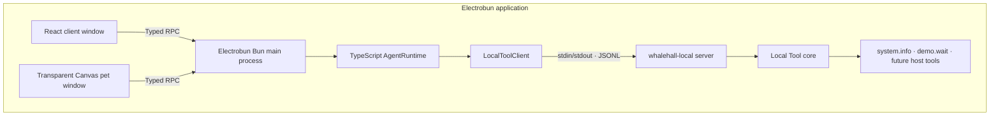

# Sea-WhaleHall

> A whale falls, and myriad creatures flourish.

WhaleHall is an Electrobun desktop application with a React control window, a transparent Canvas desktop companion, a thin TypeScript Agent boundary, and a Rust Local Tool Host connected over newline-delimited JSON.

The architecture borrows Codex's separation between a thin client layer and a native process without copying the size of the Codex monorepo. In WhaleHall, Rust owns local host capabilities rather than model reasoning.

## Architecture



The TypeScript Agent is deliberately small: it exposes a stable orchestration boundary and forwards typed Local Tool calls. Tool registration, validation, execution, progress, cancellation, and concurrency control live in Rust. The browser contexts never communicate directly.

## Development areas / 开发区域

| Area | Location | Responsibility |
| --- | --- | --- |
| Client frontend | [`src/views/client`](src/views/client) | Local Tool catalog, invocation, progress/cancellation, runtime status, and pet visibility |
| Pet frontend | [`src/views/pet`](src/views/pet) | Transparent Canvas companion, interaction, and replaceable `PetRenderer` interface |
| TypeScript Agent | [`src/agent`](src/agent) | Thin Agent facade, Local Tool process client, and handwritten protocol mirror |
| Electrobun main process | [`src/bun/index.ts`](src/bun/index.ts) | Window creation, Typed RPC routing, lifecycle, and Agent composition |
| Shared frontend contracts | [`src/shared`](src/shared) | Electrobun Typed RPC schemas shared with both WebViews |
| Rust Local protocol | [`whalehall-local/protocol`](whalehall-local/protocol) | JSONL requests, responses, tool descriptors, events, and errors |
| Rust Local core | [`whalehall-local/core`](whalehall-local/core) | Tool registry, execution, progress, cancellation, and future host integrations |
| Rust Local server | [`whalehall-local/server`](whalehall-local/server) | Concurrent stdin/stdout JSONL server and packaged executable |

Future browser control, application usage tracking, filesystem operations, and OS integrations belong under `whalehall-local/core/src/tools/`. LLM providers, task planning, and conversation orchestration belong under `src/agent/`.

Generated files stay outside source areas:

```text
dist/views/                         Vite output for client and pet pages
whalehall-local/target/             Cargo build cache and binaries
.native/<platform>-<architecture>/  Native binary staged before packaging
build/                              Electrobun application bundles
artifacts/                          Unsigned canary packages
```

At runtime, the pages load independently from `views://client/index.html` and `views://pet/index.html`. The packaged `whalehall-local(.exe)` binary is loaded from `PATHS.RESOURCES_FOLDER/app/native`.

## Requirements

- Bun `1.3.14`
- Rust `1.97.1` with Cargo, rustfmt, and Clippy
- Electrobun `1.18.1`
- macOS 14+, Windows 11+, or Ubuntu 22.04+
- Platform build tools required by [Electrobun](https://github.com/blackboardsh/electrobun#prerequisites)

On macOS with Homebrew:

```bash
brew install bun rust
```

Linux builds require GTK/WebKit development packages even though the pet window uses bundled CEF:

```bash
sudo apt install build-essential cmake pkg-config libgtk-3-dev \
  libwebkit2gtk-4.1-dev libayatana-appindicator3-dev librsvg2-dev
```

## Development

Install locked dependencies:

```bash
bun install --frozen-lockfile
```

Start both Vite pages with HMR and Electrobun:

```bash
bun run dev:hmr
```

Start Electrobun with bundled views and its rebuild watcher:

```bash
bun run dev
```

The pre-build hook compiles `whalehall-local-server` in release mode and stages `whalehall-local(.exe)` under `.native/` for the current native platform.

## Validation and builds

```bash
# TypeScript typecheck, Rust format/Clippy/tests, Bun tests, and JSONL integration
bun run check

# Build views or only the native Local Tool Host
bun run build:views
bun run build:native

# Build an unsigned Electrobun canary artifact for the current host
bun run build:canary
```

GitHub Actions repeats these checks natively on macOS ARM64, Windows x64, and Linux x64, then retains unsigned artifacts for seven days.

## Local Tool protocol

Every protocol frame is one UTF-8 JSON object followed by `\n`. Control requests use a five-second timeout; tool calls use a thirty-second timeout. Both sides reject protocol lines over 1 MiB.

Requests:

```json
{"id":"health-1","method":"runtime.health","params":{}}
{"id":"list-1","method":"tool.list","params":{}}
{"id":"call-1","method":"tool.call","params":{"name":"system.info","arguments":{}}}
{"id":"cancel-1","method":"tool.cancel","params":{"callId":"call-1"}}
```

Responses:

```json
{"id":"call-1","ok":true,"result":{"callId":"call-1","output":{"os":"macos"}}}
{"id":"call-1","ok":false,"error":{"code":"CANCELLED","message":"Local tool call was cancelled."}}
```

The `tool.call` request ID is also its `callId`. Rust can emit events before the final response:

```json
{"event":"tool.started","callId":"call-1","data":{"name":"demo.wait"}}
{"event":"tool.progress","callId":"call-1","data":{"progress":50,"message":"Waiting"}}
{"event":"tool.cancelled","callId":"call-1","data":{"name":"demo.wait"}}
```

Tool descriptors expose `name`, `description`, JSON `inputSchema`, `risk`, `requiredPermissions`, and `supportsCancellation`. Rust and TypeScript maintain handwritten protocol types and validate them against the same checked-in fixtures.

## Initial Local Tools

- `system.info` returns OS, architecture, Local Tool Host version, and process ID. It does not read the user or host name.
- `demo.wait` accepts `durationMs` from 100 to 5000, emits progress, and supports cancellation.

The initial scaffold does not call a model API, request OS permissions, control a browser, collect application usage, or persist data. These are future capabilities built on the Local Tool registry and the TS Agent boundary.

`PetRenderer` remains independent of the Canvas implementation so a licensed Live2D Cubism renderer and model assets can be added without changing window or RPC contracts.
