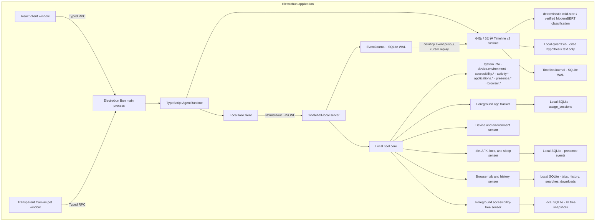

# Sea-WhaleHall

> A whale falls, and myriad creatures flourish.

WhaleHall is an Electrobun desktop application with a React control window, a transparent Canvas desktop companion, a thin TypeScript Agent boundary, and a Rust Local Tool Host connected over newline-delimited JSON.

The architecture borrows Codex's separation between a thin client layer and a native process without copying the size of the Codex monorepo. In WhaleHall, Rust owns local host capabilities rather than model reasoning.

## Architecture



The TypeScript Agent exposes a stable orchestration boundary, forwards typed Local Tool calls, and owns deterministic reflection windowing/model orchestration. Tool registration, native sensing, event journaling, validation, execution, progress, cancellation, and concurrency control live in Rust. The browser contexts never communicate directly.

## Development areas / 开发区域

| Area | Location | Responsibility |
| --- | --- | --- |
| Client frontend | [`src/views/client`](src/views/client) | Authentication gate, planning, calendar, reports, settings, and client-side service adapters |
| Pet frontend | [`src/views/pet`](src/views/pet) | Transparent Canvas companion, interaction, and replaceable `PetRenderer` interface |
| TypeScript Agent | [`src/agent`](src/agent) | Thin Agent facade, Local Tool process client, and handwritten protocol mirror |
| Electrobun main process | [`src/bun/index.ts`](src/bun/index.ts) | Window creation, Typed RPC routing, lifecycle, and Agent composition |
| Shared frontend contracts | [`src/shared`](src/shared) | Electrobun Typed RPC schemas shared with both WebViews |
| Rust Local protocol | [`whalehall-local/protocol`](whalehall-local/protocol) | JSONL requests, responses, tool descriptors, events, and errors |
| Rust Local core | [`whalehall-local/core`](whalehall-local/core) | Tool registry plus one-file sensor entry points, foreground tracking, and SQLite persistence |
| Rust Local server | [`whalehall-local/server`](whalehall-local/server) | Concurrent stdin/stdout JSONL server and packaged executable |

Project contribution and frontend implementation rules:

- [`AGENTS.md`](AGENTS.md) — repository boundaries, required reading, validation, and visual acceptance;
- [`CONTRIBUTING.md`](CONTRIBUTING.md) — environment, commands, branches, commits, and pull requests;
- [`docs/frontend/UI_REFERENCES.md`](docs/frontend/UI_REFERENCES.md) — permitted UI reference principles and brand limits;
- [`docs/frontend/FRONTEND_STANDARD.md`](docs/frontend/FRONTEND_STANDARD.md) — feature-first React architecture and Definition of Done;
- [`docs/frontend/CALENDAR_STANDARD.md`](docs/frontend/CALENDAR_STANDARD.md) — calendar domain, adapter, interaction, timezone, and QA rules.
- [`docs/REFLECTION_SYSTEM.md`](docs/REFLECTION_SYSTEM.md) — behavior events, 64/5-minute windows, persistence, model locks, privacy, and training/runtime operations.

Every sensor has one public entry file under `whalehall-local/core/src/sensors/`; Agent-facing adapters live under `whalehall-local/core/src/tools/`. Stateful support code such as the activity SQLite engine remains private to the Rust core. The sensor layout, accessibility tree, device snapshot contract, resident application/process inventory, presence monitor, and browser activity monitor are documented in [`whalehall-local/SENSORS.md`](whalehall-local/SENSORS.md). Future browser control, filesystem operations, and other OS integrations also belong in the Rust core. LLM providers, task planning, and conversation orchestration belong under `src/agent/`.

Generated files stay outside source areas:

```text
dist/views/                         Vite output for client and pet pages
whalehall-local/target/             Cargo build cache and binaries
.native/<platform>-<architecture>/  Native binary staged before packaging
build/                              Electrobun application bundles
artifacts/                          Unsigned canary packages
```

At runtime, the pages load independently from `views://client/index.html` and `views://pet/index.html`. The packaged `whalehall-local(.exe)` binary is loaded from `PATHS.RESOURCES_FOLDER/app/native`.

## Requirements

- Bun `1.3.14`
- Rust `1.97.1` with Cargo, rustfmt, and Clippy
- Electrobun `1.18.1`
- macOS 14+, Windows 11+, or Ubuntu 22.04+
- Platform build tools required by [Electrobun](https://github.com/blackboardsh/electrobun#prerequisites)

On macOS with Homebrew:

```bash
brew install bun rust
```

Linux builds require GTK/WebKit development packages even though the pet window uses bundled CEF:

```bash
sudo apt install build-essential cmake pkg-config libdbus-1-dev libxcb-ewmh-dev \
  libxcb-randr0-dev libgtk-3-dev \
  libwebkit2gtk-4.1-dev libayatana-appindicator3-dev librsvg2-dev
```

## Development

Install locked dependencies:

```bash
bun install --frozen-lockfile
```

Start both Vite pages with HMR and Electrobun:

```bash
bun run dev:hmr
```

Start Electrobun with bundled views and its rebuild watcher:

```bash
bun run dev
```

On macOS, install one fixed current-user development signing identity before
granting monitoring permissions to a local build:

```bash
# Read-only status; never opens or changes Keychain.
bun run setup:macos-signing

# Explicit one-time setup. If macOS asks about private-key access, choose
# "Always Allow"; the command verifies the choice with a second signature.
bun run setup:macos-signing -- --create
```

Normal development and canary builds automatically use the one valid identity
named exactly `WhaleHall Local Development`. The fixed certificate gives the
native monitoring components a stable designated requirement, so one macOS
monitoring authorization can be reused across rebuilds. Local encrypted content
is opened only by the signed, versioned Vault Broker that WhaleHall installs
once in its shared owner-only application data directory; dev and canary reuse
that same installed version. The current immutable generation is v2
(`whalehall-vault-broker-v2`, broker identity/service/protocol v2) and includes
a Mach-O `LC_UUID`. The invalid no-UUID v1 artifact is never executed,
overwritten, or republished as v2: v2 uses a new bundle/install basename,
directory, signing identifier, Keychain service, and wire magic. Ordinary
application rebuilds neither replace that Broker nor change the Keychain
partition bound to it. An existing
pre-Broker local key requires one explicit migration from the monitoring UI.
The old item is retained, the new item is verified before use, and conflicts
fail closed. If the local identity or Broker is absent, development builds
remain available but are explicitly metadata-only; sensitive observation
content and the content vault stay unavailable.

Running the mutating setup command again for an existing valid identity does not
replace it. It only performs two temporary signatures to verify that
`/usr/bin/codesign` has persistent access. This check does not authorize the
content vault. Normal rebuilds do not change the Vault Broker or its Keychain
ACL and therefore do not repeat the vault migration prompt.

The classic login-Keychain fallback and owner-only install directory used by
local dev/canary builds are convenience isolation, not a hostile same-account
security boundary. Before WhaleHall's first v2 install/item creation, another
process already running as the same macOS UID can squat those per-user
namespaces; local builds fail closed on the conflicts they can identify, but
cannot generally prove the namespace was not pre-created. Production does not
use this fallback: a Developer ID-signed build uses the Data Protection
Keychain with the signed application access group.

The local identity is never accepted for a stable or explicitly signed release.
Those builds require a valid `Developer ID Application` identity, a matching
`WHALEHALL_APPLE_TEAM_ID`, hardened runtime, and notarization.

The pre-build hook compiles `whalehall-local-server` in release mode and stages `whalehall-local(.exe)` under `.native/` for the current native platform.

## Desktop pet / 桌宠

The desktop pet ships with 133 canonical actions across idle, movement, pointer interaction, emotion, daily life, assistant functions, time/environment events, and transitions. Hover, click, double-click, rapid click, petting, poking, and native window dragging all feed the same production interaction state machine.

Run `bun run dev:hmr`, then open `http://127.0.0.1:5173/pet/demo.html` to use the Action Lab. It can search and play every action, switch between the whale and cat models, inspect semantic frames, and exercise the same `CanvasPetRenderer` used by the transparent desktop window.

Animations emit model-independent `PetFrame` values. To add or replace a pet, implement the `PetModel` contract under [`src/views/pet/models`](src/views/pet/models) and register it in [`registry.ts`](src/views/pet/models/registry.ts); the action engine and RPC contracts do not need model-specific branches.

Validate the complete action catalog and finite frame output with:

```bash
bun run scripts/verify-pet-animations.ts
```

## Validation and builds

```bash
# TypeScript typecheck, Rust format/Clippy/tests, Bun tests, and JSONL integration
bun run check

# Report Biome findings in files changed against main
bun run lint:changed

# Build views or only the native Local Tool Host
bun run build:views
bun run build:native

# Build an unsigned Electrobun canary artifact for the current host
bun run build:canary
```

GitHub Actions repeats these checks across hosted macOS and Windows, multiple Ubuntu versions, mainstream Linux distribution containers, and a virtual X11 desktop before retaining unsigned artifacts for seven days. The real desktop certification matrix and its runner requirements are documented in [`.github/CI_COMPATIBILITY.md`](.github/CI_COMPATIBILITY.md).

## Local Tool protocol

Every protocol frame is one UTF-8 JSON object followed by `\n`. Control requests use a five-second timeout; tool calls use a thirty-second timeout. Both sides reject protocol lines over 1 MiB.

Requests:

```json
{"id":"health-1","method":"runtime.health","params":{}}
{"id":"list-1","method":"tool.list","params":{}}
{"id":"call-1","method":"tool.call","params":{"name":"system.info","arguments":{}}}
{"id":"cancel-1","method":"tool.cancel","params":{"callId":"call-1"}}
{"id":"events-1","method":"event.query","params":{"consumerId":"whalehall.reflection.v1","limit":256}}
{"id":"commit-1","method":"event.commit","params":{"consumerId":"whalehall.reflection.v1","cursor":"ec1_0000000000000001"}}
{"id":"goal-1","method":"event.goal.change","params":{"previous":null,"next":{"goalId":"goal-1","planId":null,"version":1,"text":"Ship WhaleHall reflection","activatedAtMs":1700000000000},"occurredAtMs":1700000000000,"deduplicationKey":"goal-change:goal-1:1"}}
```

Responses:

```json
{"id":"call-1","ok":true,"result":{"callId":"call-1","output":{"os":"macos"}}}
{"id":"call-1","ok":false,"error":{"code":"CANCELLED","message":"Local tool call was cancelled."}}
{"id":"goal-1","ok":true,"result":{"event":{"schemaVersion":"desktop-event.v1","eventId":"de1_example","cursor":"ec1_0000000000000002","deviceId":"device_example","sessionId":"session_example","kind":"goal.contextChanged","source":"planning.controller","occurredAtMs":1700000000000,"observedAtMs":1700000000000,"goalVersion":null,"sensitivity":"content","payload":{"previous":null,"next":{"goalId":"goal-1","planId":null,"version":1,"text":"Ship WhaleHall reflection","activatedAtMs":1700000000000}}},"inserted":true}}
```

`event.goal.change` is the only protocol write that can append a caller-supplied
semantic boundary; the server does not expose a general event append method.
Rust validates and bounds both goal contexts, writes the content-sensitive
boundary atomically, and returns the durable event/cursor. Replaying the same
stable deduplication key returns that event with `inserted:false`.

EventJournal applies its 30-day retention cleanup once at server startup and
then daily. Cleanup is consumer-aware and never deletes beyond the slowest
persisted named-consumer cursor; cleanup errors are warnings and do not stop the
local server.

The `tool.call` request ID is also its `callId`. Rust can emit events before the final response:

```json
{"event":"tool.started","callId":"call-1","data":{"name":"demo.wait"}}
{"event":"tool.progress","callId":"call-1","data":{"progress":50,"message":"Waiting"}}
{"event":"tool.cancelled","callId":"call-1","data":{"name":"demo.wait"}}
{"event":"desktop.event","data":{"schemaVersion":"desktop-event.v1","eventId":"de1_example","cursor":"ec1_0000000000000001","deviceId":"device_example","sessionId":"session_example","kind":"application.foregroundChanged","source":"activity.sensor","occurredAtMs":1000,"observedAtMs":1001,"goalVersion":null,"sensitivity":"metadata","payload":{"appId":"com.example.Editor","appName":"Editor"}}}
```

Tool descriptors expose `name`, `description`, JSON `inputSchema`, `risk`, `requiredPermissions`, and `supportsCancellation`. Rust and TypeScript maintain handwritten protocol types and validate them against the same checked-in fixtures.

## Initial Local Tools

- `system.info` returns OS, architecture, Local Tool Host version, and process ID. It does not read the user or host name.
- `demo.wait` accepts `durationMs` from 100 to 5000, emits progress, and supports cancellation.
- `device.environment` returns OS version, device name, local username, language preferences, timezone, displays and resolutions, CPU, memory, batteries, and network interfaces. Because it exposes local identity and addresses, it declares the `device.environment.read` permission.
- `accessibility.status` returns foreground accessibility capabilities and a value-free focused-control summary.
- `accessibility.tree` queries buttons, menus, text boxes, selection, and bounded document excerpts from `accessibility.sqlite3`. Values and document text require explicit flags, protected input is always redacted, and both Tools require `accessibility.read`.
- `activity.status` returns monitor state, current foreground session, sampling interval, and the exact database path.
- `activity.sessions` reads raw sessions with `limit`, `fromMs`, `toMs`, `appId`, and `includeOpen` filters. Its descriptor declares the `activity.read` permission because usage history is sensitive local data.
- `activity.cleanup` deletes local history with `scope: "longTerm" | "shortTerm" | "all"`. It is a write-risk Tool and declares the `activity.delete` permission.
- `applications.status`, `applications.installed`, and `applications.processes` expose the resident installed-application and process inventory stored in `applications.sqlite3`.
- `presence.status` returns last input, idle/AFK, nullable lock state, sleep/wake state, and platform capability warnings.
- `presence.events` queries AFK, lock/unlock, and sleep/wake events from `presence.sqlite3`. Both presence Tools require `presence.read`.
- `input.status` reports whether the explicitly enabled five-second key/click/scroll/movement aggregator is running, degraded, or revoked; it never returns key values, pointer coordinates, or raw input samples.
- `browser.status` and `browser.tabs` expose current tab title, URL, domain, nullable audio state, and session boundaries.
- `browser.history`, `browser.searches`, and `browser.downloads` query the local `browser.sqlite3` import. All browser Tools require the high-impact `browser.read` permission.
- `editor.status` reports explicit VS Code bridge enablement, spool health, quarantine state, open edit bursts, and durable outbox backlog without returning document content. It requires `editor.metadata`.

Timeline v2 classifies with the explicit `deterministic-cold-start.v2` implementation by default. Its ModernBERT episode adapter is an opt-in trust boundary: it accepts loopback endpoints, or an exact allowlisted HTTPS origin, and sends facts only after a caller-pinned v2 artifact manifest matches field-for-field. The pinned loopback `qwen3:4b` is a separate cited-hypothesis text generator; it never receives or supplies ModernBERT class probabilities. Serving code or an endpoint address alone is never treated as proof that a trained, calibrated artifact is ready. WhaleHall still does not control a browser.

## Foreground application usage and SQLite

The tracker adapts the useful boundary from [Planshit/Tai](https://github.com/Planshit/Tai): foreground detection and duration accounting are separate from presentation. WhaleHall changes the storage model to preserve raw sessions before computing summaries.

`whalehall-local` starts the tracker automatically and stores `usage.sqlite3` under the operating system's per-application data directory. `activity.status` is the authoritative way to retrieve the exact path for the current platform and release channel. Embedders and tests can override the directory with `WHALEHALL_DATA_DIR`; isolated tests therefore never write into real user history.

Each row in `usage_sessions` contains:

- stable application ID, display name, executable path, process ID, and an available window title;
- UTC `started_at_ms`, `last_seen_at_ms`, nullable `ended_at_ms`, and `duration_ms`;
- an explicit `end_reason`: `app_switch`, `shutdown`, `foreground_unavailable`, `observation_gap`, or `recovered_after_unclean_shutdown`.

The first observation inserts an open session immediately. Whenever `(app_id, process_id)` changes, one SQLite `IMMEDIATE` transaction closes the previous row and inserts the next row at the same observed timestamp. No daily or hourly aggregation can erase a short switch, including a zero-millisecond deterministic test transition. A five-second heartbeat bounds data loss after a crash; startup closes a stale open row at its last heartbeat instead of counting the offline period. A suspended event loop is detected as an observation gap and is also excluded from usage time. Normal application shutdown waits for Rust to close the current row before force termination.

The system foreground source is native Rust integration on each platform: macOS uses the Process Manager front PID plus `NSRunningApplication`, Windows uses the foreground HWND/process APIs, and Linux supports X11 plus KWin/Hyprland Wayland sessions. macOS does not require Accessibility or Screen Recording permission and intentionally leaves `window_title` empty. On Linux, a desktop session that does not expose active-window information reports `degraded` and closes the current session instead of inventing usage.

The foreground source is sampled every 100 ms by default (`WHALEHALL_ACTIVITY_POLL_MS`, allowed range 50–5000 ms). Every observed application change creates a distinct session; a switch that begins and ends entirely between two samples is below the monitor's observable resolution.

Cleanup is explicit and local: `longTerm` retains the latest 30 days, `shortTerm` retains the latest 7 days, and `all` deletes every row. Retention cleanup only removes closed sessions whose `ended_at_ms` is before the cutoff. Complete cleanup is serialized through the monitor, clears its in-memory current session, and lets the next foreground observation create a fresh row, so the resident sensor continues normally after deletion.

The detailed Rust ownership, lifecycle, schema, API, Tool, privacy, and extension contract is documented in [`whalehall-local/ACTIVITY_SENSOR.md`](whalehall-local/ACTIVITY_SENSOR.md).

### Verifying activity history

1. Run `bun run dev`, open the Local Tools panel, and invoke `activity.status` with `{}`. Confirm `state` is `running` and note `databasePath`.
2. Switch between two applications, wait at least one sampling interval in each, then invoke `activity.sessions` with `{"limit":20}`.
3. Confirm every adjacent pair satisfies `previous.endedAtMs === next.startedAtMs`, and that the newest session has `endedAtMs: null` while WhaleHall is running.
4. Close WhaleHall and inspect the last row at the path reported in step 1:

```bash
sqlite3 /absolute/path/from/activity.status \
  'PRAGMA integrity_check; SELECT id, app_id, started_at_ms, ended_at_ms, duration_ms, end_reason FROM usage_sessions ORDER BY id DESC LIMIT 20;'
```

The final row must have non-null `ended_at_ms` and `end_reason = 'shutdown'`. `bun run check` additionally verifies exact switch boundaries, zero-duration switches, heartbeats, crash recovery, query validation, SQLite creation, JSONL tool access, and Rust/TypeScript contracts in isolated temporary databases.

`PetRenderer` remains independent of the Canvas implementation so a licensed Live2D Cubism renderer and model assets can be added without changing window or RPC contracts.
