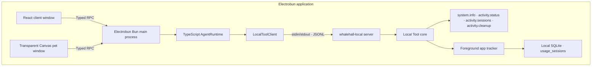

# Sea-WhaleHall

> A whale falls, and myriad creatures flourish.

WhaleHall is an Electrobun desktop application with a React control window, a transparent Canvas desktop companion, a thin TypeScript Agent boundary, and a Rust Local Tool Host connected over newline-delimited JSON.

The architecture borrows Codex's separation between a thin client layer and a native process without copying the size of the Codex monorepo. In WhaleHall, Rust owns local host capabilities rather than model reasoning.

## Architecture



The TypeScript Agent is deliberately small: it exposes a stable orchestration boundary and forwards typed Local Tool calls. Tool registration, validation, execution, progress, cancellation, and concurrency control live in Rust. The browser contexts never communicate directly.

## Development areas / 开发区域

| Area | Location | Responsibility |
| --- | --- | --- |
| Client frontend | [`src/views/client`](src/views/client) | Local Tool catalog, invocation, progress/cancellation, runtime status, and pet visibility |
| Pet frontend | [`src/views/pet`](src/views/pet) | Transparent Canvas companion, interaction, and replaceable `PetRenderer` interface |
| TypeScript Agent | [`src/agent`](src/agent) | Thin Agent facade, Local Tool process client, and handwritten protocol mirror |
| Electrobun main process | [`src/bun/index.ts`](src/bun/index.ts) | Window creation, Typed RPC routing, lifecycle, and Agent composition |
| Shared frontend contracts | [`src/shared`](src/shared) | Electrobun Typed RPC schemas shared with both WebViews |
| Rust Local protocol | [`whalehall-local/protocol`](whalehall-local/protocol) | JSONL requests, responses, tool descriptors, events, and errors |
| Rust Local core | [`whalehall-local/core`](whalehall-local/core) | Tool registry plus foreground-application tracking and SQLite persistence |
| Rust Local server | [`whalehall-local/server`](whalehall-local/server) | Concurrent stdin/stdout JSONL server and packaged executable |

Foreground application tracking lives under `whalehall-local/core/src/activity/`; read-only Agent-facing access lives under `whalehall-local/core/src/tools/`. Future browser control, filesystem operations, and other OS integrations also belong in the Rust core. LLM providers, task planning, and conversation orchestration belong under `src/agent/`.

Generated files stay outside source areas:

```text
dist/views/                         Vite output for client and pet pages
whalehall-local/target/             Cargo build cache and binaries
.native/<platform>-<architecture>/  Native binary staged before packaging
build/                              Electrobun application bundles
artifacts/                          Unsigned canary packages
```

At runtime, the pages load independently from `views://client/index.html` and `views://pet/index.html`. The packaged `whalehall-local(.exe)` binary is loaded from `PATHS.RESOURCES_FOLDER/app/native`.

## Requirements

- Bun `1.3.14`
- Rust `1.97.1` with Cargo, rustfmt, and Clippy
- Electrobun `1.18.1`
- macOS 14+, Windows 11+, or Ubuntu 22.04+
- Platform build tools required by [Electrobun](https://github.com/blackboardsh/electrobun#prerequisites)

On macOS with Homebrew:

```bash
brew install bun rust
```

Linux builds require GTK/WebKit development packages even though the pet window uses bundled CEF:

```bash
sudo apt install build-essential cmake pkg-config libdbus-1-dev libxcb1-dev libgtk-3-dev \
  libwebkit2gtk-4.1-dev libayatana-appindicator3-dev librsvg2-dev
```

## Development

Install locked dependencies:

```bash
bun install --frozen-lockfile
```

Start both Vite pages with HMR and Electrobun:

```bash
bun run dev:hmr
```

Start Electrobun with bundled views and its rebuild watcher:

```bash
bun run dev
```

The pre-build hook compiles `whalehall-local-server` in release mode and stages `whalehall-local(.exe)` under `.native/` for the current native platform.

## Validation and builds

```bash
# TypeScript typecheck, Rust format/Clippy/tests, Bun tests, and JSONL integration
bun run check

# Build views or only the native Local Tool Host
bun run build:views
bun run build:native

# Build an unsigned Electrobun canary artifact for the current host
bun run build:canary
```

GitHub Actions repeats these checks natively on macOS ARM64, Windows x64, and Linux x64, then retains unsigned artifacts for seven days.

## Local Tool protocol

Every protocol frame is one UTF-8 JSON object followed by `\n`. Control requests use a five-second timeout; tool calls use a thirty-second timeout. Both sides reject protocol lines over 1 MiB.

Requests:

```json
{"id":"health-1","method":"runtime.health","params":{}}
{"id":"list-1","method":"tool.list","params":{}}
{"id":"call-1","method":"tool.call","params":{"name":"system.info","arguments":{}}}
{"id":"cancel-1","method":"tool.cancel","params":{"callId":"call-1"}}
```

Responses:

```json
{"id":"call-1","ok":true,"result":{"callId":"call-1","output":{"os":"macos"}}}
{"id":"call-1","ok":false,"error":{"code":"CANCELLED","message":"Local tool call was cancelled."}}
```

The `tool.call` request ID is also its `callId`. Rust can emit events before the final response:

```json
{"event":"tool.started","callId":"call-1","data":{"name":"demo.wait"}}
{"event":"tool.progress","callId":"call-1","data":{"progress":50,"message":"Waiting"}}
{"event":"tool.cancelled","callId":"call-1","data":{"name":"demo.wait"}}
```

Tool descriptors expose `name`, `description`, JSON `inputSchema`, `risk`, `requiredPermissions`, and `supportsCancellation`. Rust and TypeScript maintain handwritten protocol types and validate them against the same checked-in fixtures.

## Initial Local Tools

- `system.info` returns OS, architecture, Local Tool Host version, and process ID. It does not read the user or host name.
- `demo.wait` accepts `durationMs` from 100 to 5000, emits progress, and supports cancellation.
- `activity.status` returns monitor state, current foreground session, sampling interval, and the exact database path.
- `activity.sessions` reads raw sessions with `limit`, `fromMs`, `toMs`, `appId`, and `includeOpen` filters. Its descriptor declares the `activity.read` permission because usage history is sensitive local data.
- `activity.cleanup` deletes local history with `scope: "longTerm" | "shortTerm" | "all"`. It is a write-risk Tool and declares the `activity.delete` permission.

The initial scaffold does not call a model API or control a browser. Application usage stays local and is not exposed through a network port.

## Foreground application usage and SQLite

The tracker adapts the useful boundary from [Planshit/Tai](https://github.com/Planshit/Tai): foreground detection and duration accounting are separate from presentation. WhaleHall changes the storage model to preserve raw sessions before computing summaries.

`whalehall-local` starts the tracker automatically and stores `usage.sqlite3` under the operating system's per-application data directory. `activity.status` is the authoritative way to retrieve the exact path for the current platform and release channel. Embedders and tests can override the directory with `WHALEHALL_DATA_DIR`; isolated tests therefore never write into real user history.

Each row in `usage_sessions` contains:

- stable application ID, display name, executable path, process ID, and an available window title;
- UTC `started_at_ms`, `last_seen_at_ms`, nullable `ended_at_ms`, and `duration_ms`;
- an explicit `end_reason`: `app_switch`, `shutdown`, `foreground_unavailable`, `observation_gap`, or `recovered_after_unclean_shutdown`.

The first observation inserts an open session immediately. Whenever `(app_id, process_id)` changes, one SQLite `IMMEDIATE` transaction closes the previous row and inserts the next row at the same observed timestamp. No daily or hourly aggregation can erase a short switch, including a zero-millisecond deterministic test transition. A five-second heartbeat bounds data loss after a crash; startup closes a stale open row at its last heartbeat instead of counting the offline period. A suspended event loop is detected as an observation gap and is also excluded from usage time. Normal application shutdown waits for Rust to close the current row before force termination.

The system foreground source is native Rust integration on each platform: macOS uses the Process Manager front PID plus `NSRunningApplication`, Windows uses the foreground HWND/process APIs, and Linux supports X11 plus KWin/Hyprland Wayland sessions. macOS does not require Accessibility or Screen Recording permission and intentionally leaves `window_title` empty. On Linux, a desktop session that does not expose active-window information reports `degraded` and closes the current session instead of inventing usage.

The foreground source is sampled every 100 ms by default (`WHALEHALL_ACTIVITY_POLL_MS`, allowed range 50–5000 ms). Every observed application change creates a distinct session; a switch that begins and ends entirely between two samples is below the monitor's observable resolution.

Cleanup is explicit and local: `longTerm` retains the latest 30 days, `shortTerm` retains the latest 7 days, and `all` deletes every row. Retention cleanup only removes closed sessions whose `ended_at_ms` is before the cutoff. Complete cleanup is serialized through the monitor, clears its in-memory current session, and lets the next foreground observation create a fresh row, so the resident sensor continues normally after deletion.

The detailed Rust ownership, lifecycle, schema, API, Tool, privacy, and extension contract is documented in [`whalehall-local/ACTIVITY_SENSOR.md`](whalehall-local/ACTIVITY_SENSOR.md).

### Verifying activity history

1. Run `bun run dev`, open the Local Tools panel, and invoke `activity.status` with `{}`. Confirm `state` is `running` and note `databasePath`.
2. Switch between two applications, wait at least one sampling interval in each, then invoke `activity.sessions` with `{"limit":20}`.
3. Confirm every adjacent pair satisfies `previous.endedAtMs === next.startedAtMs`, and that the newest session has `endedAtMs: null` while WhaleHall is running.
4. Close WhaleHall and inspect the last row at the path reported in step 1:

```bash
sqlite3 /absolute/path/from/activity.status \
  'PRAGMA integrity_check; SELECT id, app_id, started_at_ms, ended_at_ms, duration_ms, end_reason FROM usage_sessions ORDER BY id DESC LIMIT 20;'
```

The final row must have non-null `ended_at_ms` and `end_reason = 'shutdown'`. `bun run check` additionally verifies exact switch boundaries, zero-duration switches, heartbeats, crash recovery, query validation, SQLite creation, JSONL tool access, and Rust/TypeScript contracts in isolated temporary databases.

`PetRenderer` remains independent of the Canvas implementation so a licensed Live2D Cubism renderer and model assets can be added without changing window or RPC contracts.
