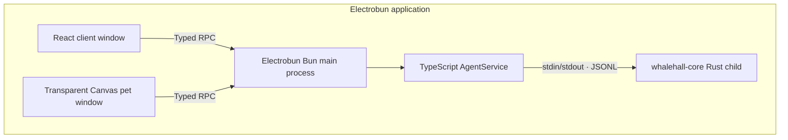

# Sea-WhaleHall

> A whale falls, and myriad creatures flourish.

WhaleHall is an Electrobun desktop application scaffold with a React control window, a transparent Canvas desktop companion, a Bun-based TypeScript agent service, and a Rust child process connected over newline-delimited JSON.

## Architecture



The browser contexts do not communicate directly. Each has its own typed RPC schema, and the Bun main process owns window coordination and native process access.

## Development areas / 开发区域

The repository is divided into the following development areas:

| Area | Location | Responsibility |
| --- | --- | --- |
| Client frontend | [`src/views/client`](src/views/client) | Main React window, runtime status, health/echo controls, and pet visibility |
| Pet frontend | [`src/views/pet`](src/views/pet) | Transparent Canvas window, animation, interaction, and the replaceable `PetRenderer` interface |
| TypeScript Agent | [`src/bun/agent`](src/bun/agent) | Agent lifecycle, Rust process management, JSONL parsing, request correlation, timeouts, and failure handling |
| Electrobun main process | [`src/bun/index.ts`](src/bun/index.ts) | Window creation, Typed RPC routing, application lifecycle, and Agent startup |
| Rust core | [`native/whalehall-core`](native/whalehall-core) | Native `health.check` and `echo` handlers over stdin/stdout JSONL |
| Shared contracts | [`src/shared`](src/shared) | Typed RPC schemas, runtime state, and Rust protocol types shared by the other areas |

Generated files are kept outside the source areas:

```text
dist/views/                         Vite output for the client and pet pages
native/whalehall-core/target/       Cargo build cache and binaries
.native/<platform>-<architecture>/  Native binary staged before packaging
build/                              Electrobun application bundles
artifacts/                          Unsigned canary packages
```

At runtime, the two frontends are loaded independently from `views://client/index.html` and `views://pet/index.html`. The packaged Rust executable is loaded from `PATHS.RESOURCES_FOLDER/app/native`; none of these areas currently owns a persistent database or data directory.

## Requirements

- Bun `1.3.14`
- Rust `1.97.1` with Cargo, rustfmt, and Clippy
- macOS 14+, Windows 11+, or Ubuntu 22.04+
- Platform build tools required by [Electrobun](https://github.com/blackboardsh/electrobun#prerequisites)

On macOS with Homebrew:

```bash
brew install bun rust
```

Linux builds require GTK/WebKit development packages even though the pet window uses bundled CEF:

```bash
sudo apt install build-essential cmake pkg-config libgtk-3-dev \
  libwebkit2gtk-4.1-dev libayatana-appindicator3-dev librsvg2-dev
```

## Development

Install the locked dependencies:

```bash
bun install --frozen-lockfile
```

Start with Vite HMR for both React pages:

```bash
bun run dev:hmr
```

Start with bundled views and Electrobun's rebuild watcher:

```bash
bun run dev
```

The first build compiles `native/whalehall-core` in release mode and stages the platform-native executable under `.native/`. Both locations are ignored by Git.

## Validation and builds

```bash
# TypeScript typecheck, Rust format/lint/tests, Bun tests, and JSONL integration
bun run check

# Build an unsigned Electrobun canary artifact for the current host
bun run build:canary
```

GitHub Actions repeats these checks natively on macOS ARM64, Windows x64, and Linux x64. Successful CI runs retain unsigned artifacts for seven days. Signing, notarization, and publishing are intentionally out of scope for this initial scaffold.

## Runtime contracts

Every Rust request is one UTF-8 JSON object followed by `\n`:

```json
{"id":"request-id","method":"health.check","params":{}}
{"id":"request-id","method":"echo","params":{"message":"hello"}}
```

Success and failure responses are also exactly one JSON object per line:

```json
{"id":"request-id","ok":true,"result":{"status":"ok"}}
{"id":"request-id","ok":false,"error":{"code":"METHOD_NOT_FOUND","message":"Unknown method"}}
```

The Bun bridge correlates IDs, enforces a five-second timeout and a 1 MiB line limit, rejects pending work on child exit or protocol corruption, and only attempts to restart when a later explicit request arrives. Echo input is capped at 4096 characters in both TypeScript and Rust.

## Project layout

```text
src/
  bun/agent/            TypeScript AgentService and Rust JSONL bridge
  shared/               Typed RPC and JSONL contracts
  views/client/         React control window
  views/pet/            Transparent Canvas companion and renderer interface
native/whalehall-core/  Rust JSONL child process
scripts/                Cross-platform Electrobun pre-build hooks
tests/                  Bun unit and integration tests
```

`PetRenderer` is deliberately independent of the Canvas implementation so a licensed Live2D Cubism renderer and model assets can be added later without changing the window or RPC contracts.
