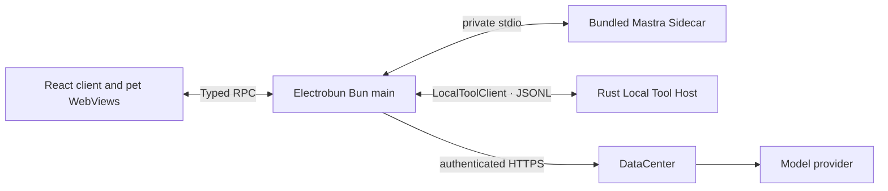

# Sea-WhaleHall

> A whale falls, and myriad creatures flourish.

WhaleHall brings personal planning, activity review, and an animated companion
to your desktop. It combines a React workspace with a transparent pet window,
local activity sensing, and a bundled Mastra Agent runtime.

**[Quick start](#quick-start)** · [Documentation / 文档](docs/README.md) · [Contributing](CONTRIBUTING.md) · [Apache 2.0](LICENSE)

- **Plan your time:** turn goals into plans, review proposed schedules, and manage calendar events.
- **Review activity:** collect local application and presence events, with separate permissions for sensitive content.
- **Use a desktop companion:** interact with animated whale and cat models in a transparent window.
- **Work with an Agent:** use conversation and planning through the bundled runtime and authenticated model gateway.

## Quick start

The current application signs in through the project's fixed DataCenter
service. Signed-in features and model calls require a DataCenter account.
`config.yaml` selects logical model roles and cloud-sync settings; it does not
change the service endpoint or supply provider credentials. See
[model gateway configuration](docs/REMOTE_MODEL_CONFIGURATION.md) for this boundary.

### Requirements

- macOS 14+, Windows 11+, or Ubuntu 22.04+.
- Bun `1.3.14` and Rust `1.97.1` with Cargo, rustfmt, and Clippy.
- The [platform build prerequisites](docs/desktop-runtime.md#platform-prerequisites) for Electrobun and the native components.

Electrobun is pinned in the lockfile. The build downloads and verifies the
bundled Node runtime used by the Mastra Sidecar.

### Development

With the prerequisites installed:

```bash
git clone https://github.com/Sea-Go/Sea-WhaleHall.git
cd Sea-WhaleHall
bun install --frozen-lockfile
bun run dev:hmr
```

This starts Vite HMR and the Electrobun desktop application. For development
with bundled views, use `bun run dev`.

On macOS, follow the [development signing setup](docs/desktop-runtime.md#macos-development-signing)
before granting monitoring permissions. Builds without the local signing
identity or Vault Broker run with metadata-only collection; sensitive content
and the content vault remain unavailable.

## Desktop pet / 桌宠

While Vite is running, open the [Action Lab](http://127.0.0.1:5173/pet/demo.html)
to browse and play semantic actions, switch models, and inspect frames.
It uses the same Canvas renderer as the desktop companion.

Pet models live under [`src/views/pet/models`](src/views/pet/models) and are
registered in [`registry.ts`](src/views/pet/models/registry.ts). The
`PetModel` and `PetRenderer` contracts keep model artwork independent of
animation semantics and window RPC.

## Architecture



Bun owns native windows, credentials, local persistence, and coordination.
Mastra owns conversation and planning orchestration. Rust owns sensing,
permissions, Tool execution, and local event storage. The WebViews communicate
through Bun and never receive model credentials.

Conversation currently uses text-only model calls; it does not register
product Tools. The full process graph, security boundaries, and lifecycle
contracts are in the [desktop runtime reference](docs/desktop-runtime.md#architecture).

## Development areas / 开发区域

| Area | Location |
| --- | --- |
| Client workspace | [`src/views/client`](src/views/client) |
| Desktop pet and Action Lab | [`src/views/pet`](src/views/pet) |
| Native application coordination and updates | [`src/bun`](src/bun) |
| Agent and local runtimes | [`src/agent`](src/agent) |
| Cross-runtime contracts | [`src/shared`](src/shared) |
| Rust protocol, core, and server | [`native/local-host`](native/local-host) |
| Native credential storage | [`native/credential-helper`](native/credential-helper) |
| macOS Observer and Vault Broker | [`native`](native) |
| Tests | [`tests`](tests) |

The [detailed ownership map](docs/desktop-runtime.md#development-areas) covers
module responsibilities and generated output.

## Validation and builds

```bash
bun run check
bun run build:views
```

`check` runs TypeScript checks, Rust formatting/Clippy/tests, and the Bun test
suite. View builds are separate. See [Contributing](CONTRIBUTING.md#test-and-build-commands)
for focused commands and [build and integration gates](docs/desktop-runtime.md#build-and-integration-gates)
for packaging and cross-repository CI.

## Contributing

Start with [CONTRIBUTING.md](CONTRIBUTING.md) for the development workflow,
validation, and pull request requirements. The [documentation](docs/README.md)
links the frontend, calendar, Agent, and native component guides.

## Runtime reference

<a id="local-tool-protocol"></a>
<a id="initial-local-tools"></a>

The [Local Tool protocol](docs/desktop-runtime.md#local-tool-protocol) and
[tool catalogue](docs/desktop-runtime.md#initial-local-tools) describe JSONL
requests, events, permissions, and available local capabilities.

<a id="foreground-application-usage-and-sqlite"></a>
<a id="verifying-activity-history"></a>

[Activity storage](docs/desktop-runtime.md#foreground-application-usage-and-sqlite)
and [activity verification](docs/desktop-runtime.md#verifying-activity-history)
cover SQLite sessions, crash recovery, cleanup, and inspection steps. Sensor
implementation details start at the [Rust sensor overview](native/local-host/SENSORS.md).

## License

WhaleHall is licensed under the [Apache License, Version 2.0](LICENSE), except
where otherwise noted. Third-party components and assets retain their respective
licenses.
