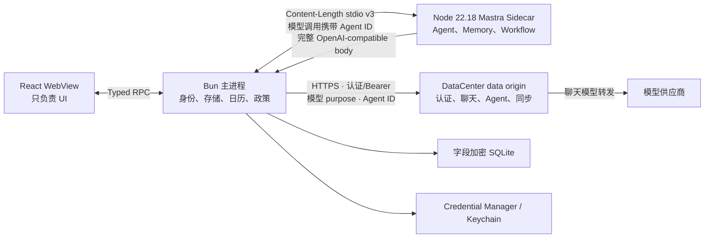
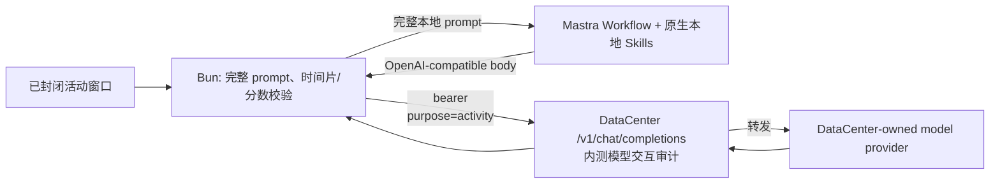

# 本地 Mastra Agent 与模型转发

WhaleHall 的“Agent 本地”是指：对话上下文、Memory、规划 Workflow、澄清、Tool 政策与审批基础设施、日历冲突修复和恢复状态均在桌面客户端运行。模型推理可由远端模型完成，但远端服务只会是身份与原始请求转发器，不是 Agent。生产桌面端使用远端账号密码登录；bearer 只保留在 Bun 主进程，不下发给 Renderer 或 Sidecar。当前 production conversation 为纯文本模式，不向模型注册产品 Tool。



## 与 Reflection / Timeline v2 的关系

Mastra 不接管行为采集、自然窗口封闭或 Timeline v2 的确定性规则，但它是
桌面所有生成式模型调用的唯一编排边界。`agent` 继续由 Mastra Agent 通过 model relay
调用；`reflection` 则由无持久化的 `activity-reflection` Workflow 和仅含 Mastra 原生本地
Skill 元工具的 Agent 使用客户端构造的完整 prompt 调用通用 relay；Dynamic Planning
通过 live-only `planning.analyze` 调用同一 Mastra model，但使用独立审计用途。



Sidecar 是客户端的一部分：它会在一次调用的内存中看到完整 `userPrompt`，并用
Mastra 生成 OpenAI-compatible body；它不接触 bearer、上游凭据或 Renderer。
Workflow 不创建可恢复 Agent run、不注册产品 Tool，也不保存 snapshot；reflection Agent
仅允许 Mastra 为两个打包 `SKILL.md` 提供的本地只读 `skill`、`skill_read`、`skill_search` 元工具，
并保持未注册，避免 Mastra durable agent-loop 写入原始 prompt。Bun 将模型 JSON 本地转换为
可核对的中文 `time + action` 事件、校验分数后，才写入 durable score ledger 并触发后台
activity Agent。

`LocalToolClient` 继续通过 JSONL 驱动 Rust Local Tool Host；EventJournal 继续
提供 durable cursor replay；Timeline v2 固定使用确定性分类与带事实引用的模板，
Reflection journal 使用保守 abstain 路径。生产桌面不连接或探测本机模型服务。

两条本地流水线共享 Bun 的生命周期和账号清理屏障，但状态所有权彼此隔离：
Mastra 的 conversation、workflow、审批与权威日历进入字段加密的 Agent
SQLite；sensor、EventJournal、Reflection 和 Timeline 数据仍由既有 Rust/本地
repository 管理。Mastra 首版不会把 browser、accessibility、activity、cleanup
或完整 Rust Tool catalogue 注册成可调用工具。

macOS 的签名 Observer 和不可变 `whalehall-vault-broker-v2` 安全链保持不变。
Vault Broker 负责敏感 observation content；新增的 credential helper 只负责
固定 WhaleHall namespace 下的账号凭据和 Agent 数据密钥，二者不能互相替代。
可编辑 `config.yaml` 保存 `agent`、`planning` 与 `reflection` 三个固定逻辑角色；真实
Provider 模型由 DataCenter 私有 YAML 映射。对话和后台 activity 使用 `agent`，任务规划
与 Dynamic Planning 使用 `planning`，sealed-window reflection 使用 `reflection`。DataCenter
origin 固定在代码中；Timeline 与 Reflection journal 不从配置接受模型地址。

## 不可跨越的边界

- React 不导入 Mastra、AI SDK、数据库、Rust 协议或 native API；Renderer 不提交 `userId`。
- Sidecar 不接触 access token、refresh token、厂商 API Key或 OS 凭据库，不监听 HTTP 端口，也不启用 Mastra Server、Studio、Cloud 或遥测。
- Bun 从当前主进程会话推导账号，拥有加密数据库、权威日历、授权和审批；Renderer 不能提交或覆盖账号 ID。所有远端模型调用要求当前认证会话，并由 Bun 添加代码所有的 `agent|activity|planning|reflection` purpose；不存在可绕过 session 的独立模型 route。
- `reflection.analyze` 协议包含由 Bun 生成的完整 `userPrompt` 和 opaque invocation ID；它只在本地 Bun/Sidecar 内存中流转。原始窗口、模型输出、事件和分数都不得回传 Renderer 或 Agent Tool。
- DataCenter 不添加 system prompt、不聚合事件、不格式化时间/action、不计算分数，也不执行 Tool。内测版会按认证 user 保存 exact request/response，并提供开发成员的受控查询；这是 internal-only 审计能力。
- Rust Local Tool Host 继续拥有传感器和本地能力。首版 Mastra Agent 不注册 browser、accessibility、activity、cleanup 或完整 Rust Tool catalogue。

## 本地运行时

`src/agent/mastra-host` 是独立 Node ESM Sidecar，固定依赖：

- `@mastra/core@1.57.0`
- `@mastra/memory@1.26.0`
- `@ai-sdk/openai-compatible@3.0.29`
- `zod@4.4.3`

打包使用 Node `22.18.0`。`scripts/node-runtime-manifest.ts` 固定官方归档 URL 和 SHA-256；缓存命中仍重新校验，随后只提取 `node[.exe]`。`scripts/build-agent-host.ts` 使用这个二进制检查生成的 Sidecar，而不是依赖用户 PATH 中的 Node。

Sidecar 与 Bun 使用双向 `Content-Length` JSON framing，当前协议版本固定为 v3：Sidecar Agent Host 从固定代码映射为每个模型调用绑定 `agentId`，并在 `model/relay.open` 中携带；Bun 校验 Agent catalog、purpose 与 owning run 后才生成远端 HTTP 头。activity owning run 还维护瞬态 `supervisor → 任一固定 specialist → voice → done` 状态，只有 relay open 成功才推进，失败、重复或越序请求都不推进；具体 specialist 仍由 Sidecar 的 guarded route 映射选择，首次接受后若 open 失败，重试必须保持同一 Agent。v2 peer 会在初始化或消息解析阶段 fail closed，不能握手后延迟到首个模型调用才暴露不兼容。单帧上限 16 MiB，模型响应块上限 64 KiB。每个运行事件带严格递增 sequence 和版本；未知消息、重复终态、倒序事件或超限帧都会 fail closed。入站 host request 保持有序，但 reverse response 与 relay frame 会立即处理，避免 Workflow 在等待 Bun 回执时发生协议死锁。正常取消由 Bun 先按 `runId` 直接中止模型 relay，再通知 Sidecar；这条路径不等待 provider 响应头。Sidecar 崩溃或协议失败时，Bun 先中止全部 relay，再把相关运行标记为中断，并按 1/5/15 秒退避重启。已持久化的澄清 Workflow 可以恢复；历史待审批状态只保留供人工处置，当前纯文本 conversation 不会自动恢复或执行 Tool。

## 本地状态和加密

Agent 数据库位于平台 `userData/agent/whalehall-agent.sqlite3`，与 Rust sensor/reflection 数据库隔离。它保存对话、消息和 partial、运行、workflow snapshot、规划草案、日历、审批、授权和幂等键。

每个账号使用独立 32 字节数据密钥；Windows 存在 Credential Manager，macOS 存在 Keychain。消息、标题、目标、Tool 参数与结果、精确排程、计划草案和 Workflow snapshot 使用 AES-256-GCM 字段加密，AAD 绑定账号、表、行、字段、schema/key/cipher version。数据库只保留必要的 opaque ID、状态、版本、时间和粗粒度日期索引明文。

普通退出只结束当前远端登录会话，不删除数据密钥或本地内容。旧数据存在但密钥丢失、密文被篡改、AAD/账号/版本不匹配时拒绝解密，绝不创建新密钥覆盖。Linux helper 明确返回 secure storage unavailable，不回退到 sessionStorage 或明文文件。

## 认证

桌面使用 `POST /v1/auth/sessions` 的邮箱密码登录，并安全保存 refresh token；短期
access token 只停留在 Bun 主进程。密码提交后立即从 React
state 清除，不写入数据库、日志、argv 或环境变量。refresh、退出与会话过期会先关闭
AuthGate、递增 generation、终止模型流并清理旧账号的本地运行，再允许新账号开始。

`config.yaml` 使用固定逻辑角色 `agent`、`planning` 与 `reflection`；DataCenter origin 固定在
代码中。每个聊天请求附带当前 session bearer 与代码所有的 purpose；relay 从 bearer 确定账户，
并由 DataCenter 私有配置选择物理上游模型。

## 对话与保留的 Tool 审批基础设施

用户消息先按 `clientMessageId` 幂等写入本地数据库，再启动 turn。Memory 默认只装载最近 24 条完整消息；partial、failed、cancelled 和 interrupted 助手消息会保留供 UI 恢复，但不自动进入下一次模型上下文。delta 由 Bun 聚合后推给 Renderer，并按 250 ms 或 512 字符阈值持久化。

生产 conversation 当前固定 `tools: {}`、`activeTools: []`、`toolChoice: none` 和
单步生成。供应商必须在固定版本与模型摘要下通过 OpenAI-compatible 流式 Tool
conformance gate，才允许重新注册产品 Tool。任何标准 Tool 事件或文本形式的
`<tool...>` 保留标记在此期间都会终止本轮并返回脱敏协议错误；客户端不得把私有
XML/JSON 标记解析成可执行调用，也不得将其写入消息或 Memory。

以下 allowlist 与审批绑定仍作为未来重新启用时的本地政策基础设施保留：

- 自动读取（需要持久化授权）：`calendar.list_events`、`planning.get_active_plan`、`planning.get_active_goal`。
- 每次确认后写入：`planning.save_draft`、`calendar.create_event`、`calendar.update_event`、`calendar.delete_event`、`calendar.commit_plan_schedule`。

审批绑定 `approvalId + runId + toolCallId + canonical arguments digest + Bun run revision`，十分钟有效且单次使用。Sidecar 自己的 version 不作为授权来源；Bun 在提议时生成 authoritative revision，Sidecar只能在后续调用中原样回传。Renderer 只看到 tool-specific 的标题、描述和风险，不看到原始参数或输出。消费审批前会重新验证数据库中解密出的 Tool、参数结构和摘要。恢复后的批准直接使用这份绑定参数在 Bun 内执行，不进入新 Sidecar；执行临界区内用户取消返回冲突，退出和 Sidecar 中断等待本地执行收敛。当前文本对话不会创建新的 Tool 提议；历史待审批状态不得因升级而自动执行。

## 规划和日历

规划 Agent 接收从今天到截止日期的完整权威日历快照，包括 timed/all-day、recurrence、occurrence、exception、event version 和 calendar revision。模型必须返回严格 structured output：一至三个澄清问题，或包含阶段、里程碑、任务、未排任务以及精确 `start/end/timeZone` 的草案。

Bun 在模型后验证 schema、引用、日期、IANA 时区、时长、截止日期、周容量、全天/重复/DST、冲突和 revision。如果无效或生成期间日历变化，只读取最新快照并自动修复一次。第二次仍失败时保存并显示完整冲突草案，不生成 fallback schedule，不提交日历。最终确认使用 expected revision 在单事务中批量写入；失败保留草案。

独立的 Dynamic PlanningRuntime 使用 `planning.analyze` 获得 strict JSON 语义结果。
`PlanningRuntime` 仍独占七日 scheduler、ETA、稳定 operation identity、proposal/confirm、
失败持久化、重试、幂等、取消和日历原子写入。provider-facing Schema 不生成
`pattern`，并以内联稳定 envelope 避免供应商原生 grammar 编译；task key 的 ASCII
grammar 由 app-side validator 强制执行。手动分析中，完整且严格合法的 proposal 即使
多带 clarification questions，也只会清掉这些多余问题后进入人工确认；相同混合输出在
automatic-adjustment 中 fail closed，不能绕过确认自动改写日历。手动提案尚无已确认偏好
时，provider 错标的 `confirmed-reuse` 会在确认边界前改回 `user-provided`；自动分析或已有
偏好不走此兼容路径。

## 远端服务

DataCenter data origin 公开桌面所需的：

- `POST /v1/auth/sessions`
- `POST /v1/auth/sessions/refresh`
- `DELETE /v1/auth/sessions/current`
- `GET /v1/auth/me`
- `POST /v1/chat/completions`
- Agent 注册、consent、crypto context 与 desktop event API

DataCenter Chat endpoint 只以 bearer subject 确定账号，拒绝 body/header 中的自报身份与
供应商凭据，执行 16 MiB 大小限制、精确模型 allowlist、账号配额、限流和幂等检查，
然后把原始 OpenAI-compatible 字节转发到 DataCenter 所有的 allowlisted provider。
SSE 保持顺序和背压；客户端取消会中止上游；完整非流式响应可按幂等键重放，
流式中断不会续传。请求幂等键保持由 run ID 与 exact body 派生；
Sidecar Agent Host 通过私有 v3 协议携带代码绑定的 Agent ID；`X-WhaleHall-Model-Purpose`
与 `X-WhaleHall-Model-Agent` 只由 Bun bridge 在完成 catalog、purpose 和 owning-run 校验后设置。
Renderer、JSON body 与调用方 HTTP headers 都不能设置或覆盖这两个字段。
raw activity outbox、receipt、score 与 Agent job 使用账号专属 ledger；未登录窗口不上传，
A 的 pending 只能由 A 重登恢复，B 无法接管。

## 本地联调和验证

```bash
bun install --frozen-lockfile
bun run build:agent-host
bun run dev:hmr
```

完整 Electrobun pre-build 会同时构建 Local Tool Host、credential helper、
固定 Node 22.18 runtime 和 Mastra bundle；macOS 还会构建 Observer 与
versioned Vault Broker，并继续执行既有 post-wrap/post-package 签名和归档校验。
在 macOS 授予 monitoring 权限前，先按 README 使用
`bun run setup:macos-signing -- --create` 建立固定本地开发身份。

桌面生产远端服务是 DataCenter。`services/model-relay/main.ts` 仅保留为历史独立的
loopback-Ollama 联调/回归资产，不参与桌面打包或生产调用，也不能作为 DataCenter 的回退。
完整门禁：

```bash
bun run typecheck
bun run test
bun run lint:changed
bun run build:views
bun run test:sensors:ci
bun run check
bun run build:canary
```

任何日志、Renderer 事件或错误提示都不得包含 token、密码、prompt、chain-of-thought、provider metadata、trace、文件路径或原始 Tool output。
