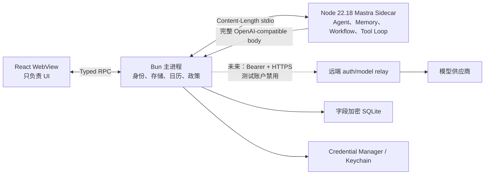

# 本地 Mastra Agent 与模型转发

WhaleHall 的“Agent 本地”是指：对话上下文、Memory、规划 Workflow、澄清、Tool Loop、审批、日历冲突修复和恢复状态均在桌面客户端运行。模型推理可由远端模型完成，但远端服务只会是身份与原始请求转发器，不是 Agent。当前开发体验只启用本地测试账户；正式远端身份尚未接入，因此模型转发会明确返回 unavailable，而不会伪造 bearer 或回退到远端 Agent。



## 不可跨越的边界

- React 不导入 Mastra、AI SDK、数据库、Rust 协议或 native API；Renderer 不提交 `userId`。
- Sidecar 不接触 access token、refresh token、厂商 API Key或 OS 凭据库，不监听 HTTP 端口，也不启用 Mastra Server、Studio、Cloud 或遥测。
- Bun 从当前主进程会话推导账号，拥有加密数据库、权威日历、授权和审批；Renderer 不能提交或覆盖账号 ID。当前测试会话没有 bearer，模型转发 fail closed。
- 远端不添加 system prompt、不拼接历史、不保存可恢复会话状态、不执行 Tool，也没有读取历史的接口。
- Rust Local Tool Host 继续拥有传感器和本地能力。首版 Mastra Agent 不注册 browser、accessibility、activity、cleanup 或完整 Rust Tool catalogue。

## 本地运行时

`src/agent/mastra-host` 是独立 Node ESM Sidecar，固定依赖：

- `@mastra/core@1.55.0`
- `@mastra/memory@1.24.0`
- `@ai-sdk/openai-compatible@3.0.20`
- `zod@4.1.12`

打包使用 Node `22.18.0`。`scripts/node-runtime-manifest.ts` 固定官方归档 URL 和 SHA-256；缓存命中仍重新校验，随后只提取 `node[.exe]`。`scripts/build-agent-host.ts` 使用这个二进制检查生成的 Sidecar，而不是依赖用户 PATH 中的 Node。

Sidecar 与 Bun 使用双向 `Content-Length` JSON framing：单帧上限 16 MiB，模型响应块上限 64 KiB。每个运行事件带严格递增 sequence 和版本；未知消息、重复终态、倒序事件或超限帧都会 fail closed。正常取消由 Bun 先按 `runId` 直接中止模型 relay，再通知 Sidecar；这条路径不等待 provider 响应头。Sidecar 崩溃或协议失败时，Bun 先中止全部 relay，再把相关运行标记为中断，并按 1/5/15 秒退避重启。已持久化的澄清 Workflow 和待审批状态仍可恢复。恢复审批时只有用户再次明确批准，Bun 才发起一次绑定参数的本地执行尝试；审批经原子消费后不自动重放，因此这是防重复的 at-most-once 语义，不是跨崩溃 exactly-once。

## 本地状态和加密

Agent 数据库位于平台 `userData/agent/whalehall-agent.sqlite3`，与 Rust sensor/reflection 数据库隔离。它保存对话、消息和 partial、运行、workflow snapshot、规划草案、日历、审批、授权和幂等键。

每个账号使用独立 32 字节数据密钥；Windows 存在 Credential Manager，macOS 存在 Keychain。消息、标题、目标、Tool 参数与结果、精确排程、计划草案和 Workflow snapshot 使用 AES-256-GCM 字段加密，AAD 绑定账号、表、行、字段、schema/key/cipher version。数据库只保留必要的 opaque ID、状态、版本、时间和粗粒度日期索引明文。

普通退出只结束当前测试会话，不删除数据密钥或本地内容。旧数据存在但密钥丢失、密文被篡改、AAD/账号/版本不匹配时拒绝解密，绝不创建新密钥覆盖。Linux helper 明确返回 secure storage unavailable，不回退到 sessionStorage 或明文文件。

## 认证

当前桌面体验账号固定为：

```text
邮箱：demo@whalehall.local
密码：whalehall
账号 ID：user-demo-wang-yiming
```

页面预填邮箱并明示体验密码。密码提交后立即从 React state 清除；Bun 只在本机严格校验这组固定值，并绑定固定账号 ID 和 session generation，不访问远端、不签发 token、不把凭据写入数据库、日志、argv 或环境变量。退出会先关闭 AuthGate 并递增 generation，同步中止模型流、隐藏日程并使 active goal 失效，再等待 Agent run和 Reflection 清理屏障。登录或恢复在本地账号初始化完成后必须复验原 session ID 与 generation，避免退出竞态返回过期成功。

桌面目前只使用模型选择配置：

```text
WHALEHALL_MODEL_ID=gpt-4.1-mini
```

正式远端账户认证、access/refresh token、旋转和 revoke 属于后续工作。在它接入前，`WHALEHALL_RELAY_URL` 不会赋予本地测试账户模型访问能力。

## 对话、Tool 与审批

用户消息先按 `clientMessageId` 幂等写入本地数据库，再启动 turn。Memory 默认只装载最近 24 条完整消息；partial、failed、cancelled 和 interrupted 助手消息会保留供 UI 恢复，但不自动进入下一次模型上下文。delta 由 Bun 聚合后推给 Renderer，并按 250 ms 或 512 字符阈值持久化。

首版 Tool allowlist：

- 自动读取（需要持久化授权）：`calendar.list_events`、`planning.get_active_plan`、`planning.get_active_goal`。
- 每次确认后写入：`planning.save_draft`、`calendar.create_event`、`calendar.update_event`、`calendar.delete_event`、`calendar.commit_plan_schedule`。

审批绑定 `approvalId + runId + toolCallId + canonical arguments digest + Bun run revision`，十分钟有效且单次使用。Sidecar 自己的 version 不作为授权来源；Bun 在提议时生成 authoritative revision，Sidecar只能在后续调用中原样回传。Renderer 只看到 tool-specific 的标题、描述和风险，不看到原始参数或输出。消费审批前会重新验证数据库中解密出的 Tool、参数结构和摘要。恢复后的批准直接使用这份绑定参数在 Bun 内执行，不进入新 Sidecar；执行临界区内用户取消返回冲突，退出和 Sidecar 中断等待本地执行收敛。拒绝不执行 Tool。

## 规划和日历

规划 Agent 接收从今天到截止日期的完整权威日历快照，包括 timed/all-day、recurrence、occurrence、exception、event version 和 calendar revision。模型必须返回严格 structured output：一至三个澄清问题，或包含阶段、里程碑、任务、未排任务以及精确 `start/end/timeZone` 的草案。

Bun 在模型后验证 schema、引用、日期、IANA 时区、时长、截止日期、周容量、全天/重复/DST、冲突和 revision。如果无效或生成期间日历变化，只读取最新快照并自动修复一次。第二次仍失败时保存并显示完整冲突草案，不生成 fallback schedule，不提交日历。最终确认使用 expected revision 在单事务中批量写入；失败保留草案。

## 远端服务

`services/model-relay` 只公开：

- `POST /v1/auth/sessions`
- `POST /v1/auth/sessions/refresh`
- `DELETE /v1/auth/sessions/current`
- `GET /v1/auth/me`
- `POST /v1/chat/completions`

Chat endpoint 只信 bearer subject，拒绝 body/header中的自报身份与供应商凭据，执行 16 MiB大小限制、精确模型 allowlist、限流和幂等检查，注入远端 provider key，然后转发原始 OpenAI-compatible字节。SSE 保持顺序和背压；客户端取消会中止上游；完整非流式响应可按幂等键重放，流式中断不会续传。部署、数据保留与多实例存储说明见 `services/model-relay/README.md`。

该服务是未来正式认证接入时的部署目标；当前固定本地测试账户不会调用这些身份接口，也没有 bearer 可调用 Chat endpoint。

## 本地联调和验证

```bash
bun install --frozen-lockfile
bun run build:agent-host
bun run dev:hmr
```

远端服务使用 `services/model-relay/main.ts`，provider key 只能在远端进程环境中设置。完整门禁：

```bash
bun run typecheck
bun run test
bun run build:views
bun run test:sensors:ci
bun run check
bun run build:canary
```

任何日志、Renderer 事件或错误提示都不得包含 token、密码、prompt、chain-of-thought、provider metadata、trace、文件路径或原始 Tool output。
