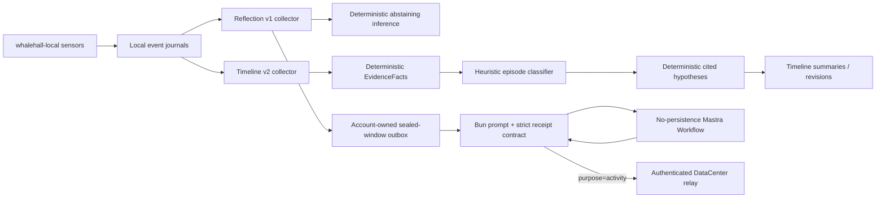

# WhaleHall Reflection 与 Timeline 系统

本文描述当前生产桌面实现。核心原则是：原始活动证据由本机确定性流水线管理；需要
生成式语义判断的 sealed-window 反思只通过认证 DataCenter/Mastra 边界；桌面不依赖
任何本机模型服务。

## 当前架构



发布不变量：

- Reflection 与 Timeline 的生产装配不会读取模型 endpoint 环境变量，不会探测 loopback，
  不会构造本地 LLM/classifier client。
- Timeline v2 固定使用 `HeuristicTimelineEpisodeClassifier` 与
  `DeterministicTimelineHypothesisGenerator`。
- Reflection v1 固定使用 `DeterministicReflectionInference`。
- 远端 activity reflection 必须经过 private stdio Sidecar、Mastra Workflow、Bun reverse
  relay 和固定 DataCenter `/v1/chat/completions`。
- 历史数据库里的旧 `modelVersion` 或 diagnostic 值只作兼容数据读取，不能恢复旧运行路径。

## Reflection v1

Reflection collector 从本地事件流形成不可变窗口。正常窗口最多 64 个 counted events，
最长等待 5 分钟；目标切换、授权变化、AFK/锁屏/睡眠等 boundary 会确定性封窗或重置。
窗口包含明确的 cursor、时间范围、目标版本、输入 hash 与 source event IDs。

`DeterministicReflectionInference` 为每个合法窗口生成 schema-valid `reflection.v1`：

- activity 固定为保守的 `other_unknown`；有目标时 relevance 为 `uncertain`；
- 概率分布接近均匀，`abstain=true`，`feedbackCode=silent`；
- 256 维 embedding 只由 window ID 与 input hash 确定性派生，不执行网络 I/O；
- evidence IDs 只来自 counted events；目标版本不一致时直接拒绝。

该路径保留 journal、重试、回放、retention 与下游账本合同，同时避免在没有经过认证的
远端合同前伪造高置信度本地结论。

### Durable job 状态

每个窗口先持久化再推理。Job 使用单并发 claim/lease，并区分 inference 与 commit 阶段：

```text
PENDING -> RUNNING -> COMMITTED
                  \-> RETRY_WAIT -> RUNNING
                  \-> TERMINAL_FAILED
```

- 进程中断后的过期 lease 可以由下一次启动回收；
- inference 失败按有界退避重试，commit 重试复用已持久化结果，不重复推理；
- shutdown cancellation 释放 claim，不消耗失败预算；
- 24 小时持续失败或明确不可重试合同错误进入 terminal failure；
- backlog 达到 job/event 阈值时进入 draining，禁止即时主动反馈但不丢窗口。

## Timeline v2

Timeline v2 从 `semantic-event.v2` 构建可审计事实、Episode、Summary 和修订。它与
Reflection v1 共享本地传感来源，但拥有独立 cursor、SQLite repository、Vault 和
恢复语义。

### 确定性流水线

1. 只接受与当前 device/session 身份一致且通过严格协议镜像校验的 semantic event。
2. `DeterministicEvidenceRenderer` 把事件投影为带 source IDs、时间、可靠性与 coverage 的
   `EvidenceFactV2`；授权 boundary 不被渲染为行为事实。
3. `HeuristicTimelineEpisodeClassifier` 依据事实结构生成分类和保守置信信息。
4. `DeterministicTimelineHypothesisGenerator` 只从 Episode 已拥有的 evidence/supporting
   fact IDs 取最多四个引用，并使用固定中文模板；它不能创造人物、意图或结果。
5. Summary、相邻窗口修订与 late-evidence correction 保持 lineage，可追溯到本地事实。

Runtime 对外保留兼容状态字段，但固定返回：

```json
{
  "configured": false,
  "artifactVerified": false,
  "activeClassifier": "deterministic-cold-start",
  "modelVersion": "deterministic-cold-start.v2",
  "code": "disabled"
}
```

`refreshEpisodeClassifier()` 只返回同一状态，不读取 manifest、不探测 endpoint、不发送事实。
`modelLockVerified`、`teacherVerified` 与 `inferenceReady` 固定为 `false`。

### Timeline 生命周期

- startup 先恢复 repository/cursor，再消费 backlog；重复 push frame 只作为 wake-up，不会
  重复提交 cursor。
- 授权撤销优先于已到期窗口；恢复授权后从干净边界重新开始。
- 正常重叠窗口不会伪造 correction；只有后来 cursor 提供的迟到证据才创建不可变修订。
- `beginShutdown()` 同步封闭 ingress 和 timer rearm；`close()` 等待 service stop 后才关闭
  repository，即使 stop 拒绝或同步 sealing 抛错也执行一次 owner close。

## 远端 sealed-window activity reflection

这是与本地确定性 journal 不同的生成式能力：

1. Bun 从已封存窗口构建完整中文 prompt、signal segment aliases 与 candidate activities。
2. `MastraActivityReflectionAnalyzer` 调用 Sidecar `reflection.analyze`。
3. Sidecar 创建 no-persistence Workflow，加载两个只读本地 Skill 规则，执行一次严格
   structured-output 模型调用；不注册产品 Tool、Memory 或 durable Agent snapshot。
4. Reverse relay 只在 Bun 仍持有 matching pending invocation 时开放，并使用代码所有的
   `purpose=activity`。
5. Bun 重新验证 output，绑定 source IDs，格式化中文 action，并提交 receipt/score ledger。

完整 raw window、prompt 与模型输出不得进入 Renderer、配置、日志或普通 Agent run。
DataCenter 不添加 prompt、不聚合事件、不计算分数。超时/取消会中止 matching relay；durable
outbox 保留窗口以便账号内重试。

## 账号、隐私与持久化

- 未登录窗口不会进入云 activity outbox。
- pending delivery、receipt 与 score ledger 都绑定 account/session generation。账号 A 的
  数据不能由账号 B 接管；登出和 session cutover 会先中止 relay，再完成 owner barrier。
- 原始内容留在本地加密 repository/Vault，除非用户明确触发受合同约束的 activity reflection
  或显式导出。
- Renderer 只收到 content-free invalidation/状态，不接收 bearer、relay credential、prompt、
  raw event 或模型响应。

## 显式训练/审计导出

`PrivateTrainingWindowExporter` 与 five-minute audit exporter 是用户显式触发的本地文件
边界，不会自动运行，不会写回生产 Timeline，也不会调用模型。导出只接受已持久化的
COMMITTED window 标识并保持 source lineage。导出物不等同于生产模型能力。

## 发布验证

至少运行：

```bash
bun test tests/reflection-inference.test.ts tests/reflection-job-runner.test.ts
bun test tests/timeline-v2-contract.test.ts tests/timeline-v2-runtime.test.ts
bun test tests/timeline-v2-analysis.test.ts tests/timeline-v2-service.test.ts
bun test tests/model-call-boundary.test.ts
```

metadata 模式只发布真实的 tab open/navigation/close 状态变化，不包含
URL 或标题；这些状态变化不会因为 payload 为空而被误判成重复轮询。

Accessibility 也采用两道默认关闭的授权：

```bash
WHALEHALL_ACCESSIBILITY_MONITORING_ENABLED=true
WHALEHALL_ACCESSIBILITY_CONTENT_MONITORING_ENABLED=false
```

metadata 模式只产生焦点角色等不含 value/document text 的事件；正文开关
开启后才允许有界 value/document change。password/secure/protected 节点
无论配置如何都不会写入值或正文。snapshot 与 event outbox 在同一 SQLite
事务中提交，EventJournal 瞬态失败后可幂等补写。

活动目标最多 1,000 个 Unicode 字符。客户端启动而计划系统没有恢复出
当前目标时会显式同步 `null`。每次 native spawn 前，Bun 都先提交一个严格
校验的 startup goal intent；EventJournal 在同一个 SQLite `IMMEDIATE`
事务中读取最新持久目标状态（包括尚未被 collector commit 的 tail），若已
达到目标则 no-op，否则按最新 revision 重基并追加目标边界。该事务完成后
才允许 resident sensors 启动，collector 随后按 cursor 补播并按目标语义
校验结果。整个 Bun 进程崩溃后的重放、新 timestamp 和 goal RPC 响应丢失
都不会产生重复边界或把目标回滚；生产启动 gate 也会阻止工具 RPC 抢先
拉起未对账的传感器进程。同步采用 latest-wins 队列并持续重试到 runtime
对同一目标返回精确 ACK。退出账号会先清空本地目标并等待 `null` ACK，再
切换账号，避免旧目标继续影响相关性判断。

## 模型运行配置

版本化的安全默认模板保存在 `config.template.yaml`；构建时它被命名为
`config.yaml` 打包，首次启动再复制为 app user-data 根目录中可编辑的
`config.yaml`。仓库不会追踪该用户副本，应用以后也不会覆盖已有副本。

家里云配置以仓库根目录的
[`config.example.yaml`](../config.example.yaml) 为模板，并阅读
[远端模型配置说明](REMOTE_MODEL_CONFIGURATION.md)。它有两个固定模型角色和一个默认关闭的
`cloudSync` 策略：

```yaml
reflection:
  name: "qwen3:1.7b"

agent:
  name: "qwen3:1.7b"

cloudSync:
  enabled: false
  contentEncryptionEnabled: false
  consents:
    activity: "off"
    browser: "off"
    presence: "off"
```

运行时两个角色都使用代码固定的 production DataCenter origin。旧文件中的 `baseurl` 和
`apikey` 只为兼容解析，其值在配置边界被丢弃，既不会发送或记录，也不会触发自动重写。
无效、部分、symlink 或超大的配置会回退到安全默认值，且不会覆盖用户原文件。

这份 YAML 只选择代码允许的模型名称与默认关闭的同步策略；所有远端模型请求都使用
当前登录会话和固定 DataCenter origin。真实凭据禁止写入 Git、配置、日志、SQLite 收据或示例文件。

`reflection` 具有活动投递职责：用户明确启用对应产品策略且登录会话可用时，投递器只接收 Reflection collector 已经封闭的
`EventWindowV1`，绝不按单条 `DesktopEventV1` 或 EventJournal cursor 调用云端。封窗规则保持
Reflection 原语义：64 条有效语义事件、第一条有效事件后的 5 分钟，或目标切换、AFK/锁屏/睡眠等
存在状态边界提前封闭一个非空窗口；进程扫描、心跳、工具和反思自身事件不计入 64 条。

每个封闭窗口只产生一次投递任务；一次模型反思可有有限的本地 Mastra Skill 加载轮次。完整且未裁剪的
`EventWindowV1`（包含原始 `events` 数组、目标快照、时间范围和封窗原因）由 Bun 构造成中文反思 prompt。
Sidecar 把随应用打包的 `skills/activity-reflection-analysis/` 和
`skills/activity-reflection-scoring/` 作为 Mastra Agent 的原生文件型 Skills：模型必须通过框架的本地
`skill` 元工具分别加载它们，必要时通过 `skill_read` 读取参考资料。前者负责六维状态判断、活动聚合、中文
action、短时间片与隐私边界，后者负责目标相关有效投入的评分公式、零分条件、累计语义和校准示例。已确认的
暂离、恢复、锁屏、解锁、睡眠、唤醒由客户端从原始窗口确定性追加为零分 `idle_transition`，模型不猜测或生成它。
两个 Skill 的文件和执行结果只存在于本地 Sidecar，不属于远端 relay，也不会成为产品 Tool。`context.response_contract` 锚定 request ID、
window ID、唯一稳定的 window source anchor、完整 source cursor 清单、封窗原因、时间范围和时区，
不替换或裁剪原始窗口。这个 prompt 只在客户端 Bun/Sidecar 的单次调用中存在；Sidecar 经 Mastra
生成 OpenAI-compatible body，再由 Bun 使用当前 session bearer 请求固定
DataCenter `/v1/chat/completions`，并添加 code-owned `purpose=activity`。

DataCenter 验证当前 user、模型 allowlist、大小、限流与转发；它不含 system prompt、事件聚合、
时间/action 格式化或分数计算。内测版按认证 user 保存 exact request/response，模型 JSON 回到客户端后，Bun 才将它
严格校验并映射为 `activity-event-analysis-response.v1`：每项可含中文 `time` 和 `action`，来源安全
归一化为本次 window anchor，不能形成窗口外引用。有效的模型短时间片会保留，客户端只补齐缺失端点；
`score_reason` 必须为不含原始敏感信息的简短中文。事件列表仅保留在 Bun 主进程及 owner-only
账号专属的 activity-window worker 收据/出站库，模型返回的 `[0,1]` `score` 通过范围、空事件为零等契约校验后
直接进入本地累加器，客户端不会重算、平均或改写它。窗口先写入本地出站库，
成功响应和分数在同一 SQLite 事务中落收据；因此重启、重复封窗通知或“远端已响应但进程尚未落库”的
情况都不会重复加分。首次启用时会在 Reflection 启动前建立本地 cutover，先前已经封闭的窗口不会被
补传。之后只恢复已经耐久进入该账号 outbox 的窗口；不会从全局 Reflection 窗口索引回扫，因为其中没有
可证明的账号 owner。封窗与 owner-aware enqueue 之间的极小崩溃窗口在 P0 选择不上传，避免错误归属。
累计值达到固定阈值 `1` 后，账本会将全部尚未消费的回执合并为一个串行后台 Agent job；只有该 job 成功后才
扣除它精确的 `consumedScore`，失败、退出、断电或账号不匹配均不扣分且可恢复。模型和投递器都不会自行调用
未定义的 Agent。reflection 与 `agent` 角色共用当前账号认证能力，但分别使用代码所有的 activity/agent
purpose。未登录窗口不进入云 outbox；A 的 outbox、receipt、score/job ledger 与 B 隔离。网络、超时或服务端暂不可用时
窗口停留在出站库并按退避重试，不会阻塞 Reflection 的 native cursor。Bearer 绝不交给 Rust 传感器、
SQLite 收据、日志、Sidecar 或 Renderer，只保留在 Bun 的安全会话边界。

## 零本机模型边界

Timeline v2 固定使用确定性分类与带引用的模板假设；Reflection journal 固定使用保守
abstain 推理。桌面生产代码不会连接、探测或启动 Ollama、ModernBERT 或其他 loopback
模型服务。需要生成式语义的对话、活动分析与 Dynamic Planning 只能通过 Mastra Sidecar，
再由 Bun 使用当前登录会话访问固定 DataCenter 网关。

`model-call-boundary` 会扫描桌面生产源码，禁止本机模型 client/lock/probe、旧模块名和模型
loopback 端口重新进入 import graph。
