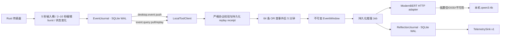

# WhaleHall 行为理解与反思系统

## 当前实现边界

WhaleHall 已实现可运行的本地事件与反思骨架：



- Rust `EventJournal` 负责事件落盘、确定性事件 ID、单调 cursor、进程内主动推送、pull 补播和 named-consumer commit；启动时及此后每日执行一次 30 天、受最慢 consumer cursor 保护的清理。
- 正常目标切换只经专用 `event.goal.change` 协议原子写入
  `goal.contextChanged` 并返回 durable cursor；本地协议不开放任意事件
  append，稳定 dedup key 的重放返回同一事件。
- 窗口内以 EventJournal cursor/数组顺序作为唯一总序；多传感器的
  `occurredAtMs` 允许回拨，训练导出不得按生产者时间重排不可变窗口。
- Rust 输入、进程、浏览器、Accessibility 和 VS Code 传感器先完成聚合与状态变化去重，再把确定性语义事件写入 EventJournal。TypeScript 不保留跨崩溃不安全的内存去重状态，只按 cursor 重放并统一执行反思封窗。第 64 条事件立即封窗，或第一条有效事件后 300,000ms 封窗。
- `reflections.sqlite3` 原子保存 collector snapshot、不可变窗口、READY job 和最终 `ReflectionV1`。推理与 sink 提交使用租约和幂等 `windowId` 恢复。
- ModernBERT 仅返回分类概率、相关性、256 维 embedding、OOD 分数和模型版本，不生成自由文本。
- Qwen 只在 ModernBERT 低置信、OOD 或暂不可用时做本地类别仲裁；其输出不作为校准概率，也不保存思维链。
- window builder 的不可变 `modelInput` 固定限制为估算 3,000 token 且
  32 KiB。超过时仍保留全部语义事件的 kind/时间骨架，并优先从最新
  主证据开始补充有界 payload；训练导出端使用同样的确定性规则。
- Student 训练与线上 artifact runner 再使用制品内锁定并做 SHA-256
  指纹校验的 ModernBERT fast tokenizer 精确计数，单序列编码
  `modelInput`，不重复拼接 `goalText`，也不允许通用 tokenizer 截断。
  超过制品 token 上限时仍须保留全部事件骨架，并按“最新主证据优先”
  结构化裁剪；无法无损保留骨架则 fail closed。
- Student 训练和线上推理进一步共用 artifact tokenizer 的精确预算：
  以单序列直接编码不可变 `modelInput`，不再把 `goalText` 重复拼接成句对；
  超过 8,192 token 时按
  `all-skeletons-latest-primary-first.v1` 做结构化裁剪。所有事件骨架仍必须
  保留，否则 fail closed。activity mask 由 fast tokenizer 对 `[EVENTS]`
  之后文本的 offset mapping 生成。
- runtime v2 固定上述输入合约和训练 tokenizer SHA-256；serving 仅从
  artifact 本地加载 tokenizer 并核对指纹，拒绝旧的 `longest_first`
  artifact。
- Student CUDA 训练默认自动选择 BF16（硬件不支持时为带 GradScaler 的
  FP16）并开启 encoder gradient checkpointing；CPU/MPS smoke 自动保持
  FP32。runtime/manifest 同时记录请求精度、实际精度、checkpointing 与
  micro-batch，避免仅靠命令日志推断训练条件。

仓库中没有伪造“已训练模型”。在完成真实授权数据、Teacher gate、GPU 训练、校准、三种随机种子、消融和冻结测试之前，ModernBERT endpoint 可能不可用；窗口会保留并按持久化退避策略重试。

## 事件计数与边界

计数前先完成语义合并：

- 键鼠样本进入固定 5 秒桶，一桶固定计为一条；
- 睡眠或长暂停后直接重对齐到最新完成的 epoch 桶，不补播中间空桶；
- VS Code 原始 delta 仅进入私有 Rust spool inbox；同文档编辑在静默 2 秒后成 burst，连续编辑 10 秒强制封 burst，只有完成的 burst 进入 EventJournal；
- 一次进程扫描的启动/退出合为一条；
- 相同前台应用、URL 和焦点的连续重复观测去重；
- goal、AFK、锁屏和睡眠为封窗边界，不计入 64；
- `reflection.*`、`tool.*` 和 heartbeat 永不进入反思计数。

Collector 没有事件时不创建五分钟 timer，不产生空反思。每个事件只属于一个窗口；上一窗口最多五条、30 秒、96 token 的内容只能作为 `contextOnly`，不重复计数或充当新证据。

边界优先级以 EventJournal 的持久化总序为准。封窗前服务会先拉取并物化
当时可见的 durable high-watermark；该范围内时间戳相同的事件按
`撤权 > goal/presence 边界 > count > deadline` 判定。high-watermark
之后才落盘的事件属于后续总序，即使生产者时间戳碰巧相同，也不会回写或
篡改已经封存的不可变窗口。这样“同时”有可恢复、可测试的定义，且 cursor
不会因跨传感器调度顺序被倒退提交。

新产生的 presence 事件使用检测时刻作为 EventJournal 的
`occurredAtMs/observedAtMs`，避免睡眠恢复后的历史估算时间倒退跨越其他
传感器 cursor。兼容旧数据时，早于当前窗口首事件的迟到边界只持久化
receipt；发生在窗口内但迟到的边界仍优先于 count，并以观测时刻封窗，
保证窗口结束时间不早于其中任何证据，也不把旧 cursor 移入下一窗口。

## 本机文件

默认位于 Electrobun 的应用数据目录；开发/测试可用 `WHALEHALL_DATA_DIR` 隔离：

| 文件 | 内容 |
| --- | --- |
| `events.sqlite3` | Rust 原始语义事件、cursor、consumer commit |
| `reflections.sqlite3` | collector snapshot、EventWindow、jobs、ReflectionJournal |
| `reflection-identity.v1.json` | 非秘密的稳定 installation/window identity，权限 `0600` |
| `usage.sqlite3` | 前台应用 session |
| `accessibility.sqlite3` | 明确授权后的 UI tree、语义状态与 durable outbox |
| `editor-bridge/editor.sqlite3` | VS Code claimed segment、durable open burst 与幂等 outbox；目录 `0700`、SQLite/WAL/SHM `0600` |

键鼠聚合器只在内存中累计当前五秒桶；非空桶直接写入
`events.sqlite3`，不会另建原始输入数据库。

## 隐私与授权

全局输入采集默认关闭。只有设备所有者或明确授权试用设备才可以设置：

```bash
WHALEHALL_INPUT_MONITORING_ENABLED=true bun run dev
```

macOS 仍需单独授予 Input Monitoring 权限。显式产品开关与系统权限是两个条件；任一条件缺失时传感器保持 disabled/degraded，而不是暗中采样或使应用崩溃。
运行期撤权会写入不计数的 `authorization.revoked`；若权限在 WhaleHall
停止期间被撤销，启用态重启也会立即补写一次 revoke（已持久化则不重复）。
授权状态以 EventJournal 为准跨进程持久化，因此即使 WhaleHall 在撤权和恢复
之间重启，listen-only tap 恢复后也会先写入 `authorization.granted`，再恢复
聚合事件。没有前置撤权的初始授权不会产生伪造的 grant。

输入事件只包含：

```json
{
  "keyCount": 12,
  "clickCount": 3,
  "scrollDelta": 5,
  "mouseDistance": 281.4,
  "bucketStartedAtMs": 1000,
  "bucketEndedAtMs": 6000
}
```

永不记录具体键值、密码、剪贴板、原始按键序列或鼠标绝对坐标。编辑正文、完整 URL 等 content 级信息必须另有明确授权；默认反思链路应优先使用应用、域名、角色、字符增删量等 metadata。

VS Code 编辑采集还要求显式设置
`WHALEHALL_VSCODE_BRIDGE_DIRECTORY`。未设置时 Rust 不猜测路径、不打开
editor SQLite，也不启动轮询。扩展的 `includeText` 是独立的正文授权；
metadata segment 不能携带文本。原始 delta 在同一 SQLite 事务中形成
durable bounded burst 后立即删除，永不作为 DesktopEvent 发布。

浏览器事件与正文信息是两道独立授权，默认都关闭：

```bash
WHALEHALL_BROWSER_EVENT_MONITORING_ENABLED=true
WHALEHALL_BROWSER_CONTENT_MONITORING_ENABLED=false
```

metadata 模式只发布真实的 tab open/navigation/close 状态变化，不包含
URL 或标题；这些状态变化不会因为 payload 为空而被误判成重复轮询。

Accessibility 也采用两道默认关闭的授权：

```bash
WHALEHALL_ACCESSIBILITY_MONITORING_ENABLED=true
WHALEHALL_ACCESSIBILITY_CONTENT_MONITORING_ENABLED=false
```

metadata 模式只产生焦点角色等不含 value/document text 的事件；正文开关
开启后才允许有界 value/document change。password/secure/protected 节点
无论配置如何都不会写入值或正文。snapshot 与 event outbox 在同一 SQLite
事务中提交，EventJournal 瞬态失败后可幂等补写。

活动目标最多 1,000 个 Unicode 字符。客户端启动而计划系统没有恢复出
当前目标时会显式同步 `null`。启动恢复先把崩溃前尚未 commit 的 journal
tail 按旧目标物化，再追加专用、幂等的原生目标边界；因此边界前后的事件
不会被重标或形成重叠窗口。同步采用 latest-wins 队列并持续重试到 runtime
对同一目标返回精确 ACK。退出账号会先清空本地目标并等待 `null` ACK，再
切换账号，避免旧目标继续影响相关性判断。

## 模型运行配置

本机 Qwen lock：

| 配置 | 值 |
| --- | --- |
| Ollama | `0.24.0` |
| 模型 | `qwen3:4b` |
| digest | `359d7dd4bcdab3d86b87d73ac27966f4dbb9f5efdfcc75d34a8764a09474fae7` |
| 参数/量化 | `4.0B` / `Q4_K_M` |
| context | `4096` |
| 并发 | `1` |
| keep alive | `30m` |

运行时在发送任何窗口前只读检查 `/api/version` 和 `/api/tags`；版本、digest、参数规模或量化不匹配时 fail closed，不会静默换模型。请求固定使用 `/api/chat`、structured output、`think:false` 和 `temperature:0`。

ModernBERT 默认只访问：

```text
http://127.0.0.1:8765/v1/reflections:infer
```

远端部署必须使用精确 HTTPS origin allowlist：

```bash
WHALEHALL_MODERNBERT_ENDPOINT=https://model.example/v1/reflections:infer
WHALEHALL_MODERNBERT_ALLOWED_ORIGINS=https://model.example
WHALEHALL_MODERNBERT_TOKEN='runtime-secret-from-secure-env'
```

不要把 token 写入仓库、训练 manifest 或日志。更简单的家里云验证方式是将远端 loopback 推理端口通过现有 SSH 控制路径转发到本机 `127.0.0.1:8765`，这样模型输入仍使用默认 loopback policy。

## 家里云只读核验

2026-07-29 通过主 FRP SSH 路径核验 `arch-server`：

- 基础模型位于 `/srv/models/modernbert-base`，包含 `model.safetensors`、config 和 tokenizer；
- 安装环境位于 `/opt/modernbert-base`；
- GPU 为 4,096 MiB RTX 3050 Ti Laptop；
- 当时没有 ModernBERT inference service/listener；`127.0.0.1:9000` 是 ClickHouse，不是模型服务；
- 家里云 Ollama 仍只有较弱的 Qwen 模型，因此不作为本计划 Teacher。

这台机器用于制品存储、加载 smoke 和部署验证。完整 DAPT/蒸馏/主动学习训练应在 16–24 GiB CUDA 节点执行。

## 训练

完整可执行流程、数据配额、Teacher A/B/C、gate、断点续跑、DAPT、多任务蒸馏、校准、评测和制品 smoke 见 [`training/README.md`](../training/README.md)。

最低验证：

```bash
PYTHONPATH=training python3 -m unittest discover -s training/tests -v
bun test tests/reflection-*.test.ts tests/ollama-*.test.ts
bun run check
```

正式运行 30 万候选或约 50 万次 Teacher 标签前，必须先用 1,000 个真实窗口记录 p50/p95、tokens/s、labels/day 并通过 Teacher gate。只有一台 Mac 的数据只能称为个人模型；跨用户结论需要约 60–100 台明确授权设备和冻结的 participant-first 测试集。
