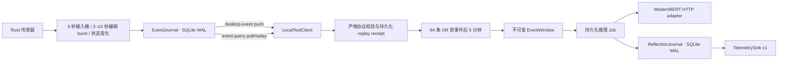

# WhaleHall 行为理解与反思系统

## Timeline v2：零扩展语义消费与 Agent 输入

v1 `DesktopReflectionService` 和 `reflections.sqlite3` 暂时保留为目标
控制与回滚兼容链路，但不再驱动主动反馈，也不进入 v2 训练。新的 Timeline
v2 使用独立 consumer、独立数据库和独立 Schema，不会把 v1 进程噪声重新
解释为训练样本：

```mermaid
flowchart LR
  Observer["内置 macOS Observer"] --> Observation["加密 ObservationJournal"]
  Observation --> Semantic["semantic-event.v2"]
  Semantic -->|"semantic.query · includeContent=true"| Collector["64 条 OR 首事件后 5 分钟"]
  Collector --> Vault["Rust vault"]
  Vault --> TimelineDb["timeline-v2.sqlite3 · 仅 contentRef/状态"]
  TimelineDb --> Facts["确定性 EvidenceFactV2"]
  Facts --> Episodes["跨窗 ActivityEpisodeV2 revision"]
  Episodes --> Qwen["本机 qwen3:4b · 有引用假设"]
  Qwen --> Summary["TimelineSummaryV2"]
  Summary --> Outbox["AgentInputV1 · HELD_LOCAL"]
```



### macOS 零扩展 Observer 与隐私边界

`native/observer` 构建为 Swift 6、macOS 14+ 的
`WhaleHall Observer.app`。它由 Rust 子进程监督，只通过 stdin/stdout
JSONL 通信；Rust 完成 ObservationJournal 事务后才 ACK。Observer 使用
NSWorkspace、AXObserver/AXUIElement、CGEventTap，以及
ScreenCaptureKit + Vision 的前台单帧 OCR，不依赖 Chrome、VSCode、飞书或
其他第三方扩展。

- 观察默认关闭，必须由用户在侧栏显式启用；一次性必需授权只有辅助功能和
  屏幕录制。listen-only `CGEventTap` 复用辅助功能授权，不单独请求输入监控；
  协议为兼容既有父进程与 Journal 仍保留 `inputMonitoring` 状态。受支持浏览器
  的 Automation 始终是可选增强，不包含在一次性必需授权中；
- 只统计按键/点击/滚动/移动量，不读取 keyCode，不保存鼠标坐标；文字只能
  来自应用最终显示的 AX/OCR 状态；
- AX 文本只接受未隐藏、具有有效几何范围且与当前焦点窗口相交的节点，并优先
  遍历 `AXVisibleChildren`；无法证明可见时不遍历完整 AX 树，改走前台窗口
  OCR 或记录 coverage gap；
- 用户排除、已识别的密码管理器/系统认证/支付/钱包、SecureField，以及隐私
  状态无法验证的浏览器会 fail closed；只写匿名 `coverage.gap`，不写真实
  app identity、PID 或内容；
- OCR 图像只在内存中存在；AX 足够时不 OCR，任务串行且只保留最新结果；
- 跨应用 AXObserver 必须运行在非 App Sandbox 的 Observer 中；该 helper 采用
  直接分发，开发/Canary 保持稳定签名，生产制品要求 Developer ID、Hardened
  Runtime 与 notarization。代码不暴露网络 client/server 接口或 socket，只经
  stdin/stdout JSONL 与 Rust 父进程通信；Apple Events 仅作为可选能力
  allow-list 当前支持并能验证隐私状态的 Chromium 浏览器；
- stdout 写入位于独立串行队列。未 ACK 上限为 256 帧/16 MiB；压力下合并
  input bucket、只保留最新 OCR，并把 gap 持久化进审计 coverage。

ObservationJournal 的正文使用 AES-256-GCM 字段加密，随机 96-bit nonce，
AAD 绑定记录身份、Schema、时间、内容 hash 和 key version。正式签名制品
只接受 `AfterFirstUnlockThisDeviceOnly` Data Protection Keychain。
无 Developer ID、但使用固定本地证书的 dev/canary 不再由每次重编译的 Rust
进程直接读取 login Keychain，而是打包一个固定身份的
`whalehall-vault-broker-v2`。Rust 首次把经过签名验证的 Broker 以排他方式复制
到跨 dev/canary 共享的 owner-only 版本目录，之后同一版本永不覆盖；Keychain
partition 因而绑定稳定的 Broker CDHash，而不是随重编译或运行 channel 变化的
主进程 CDHash。Broker 只接受来自
同一签名应用进程链的私有 socketpair 二进制协议，并在取 key 前后重新校验
audit token、代码要求、PID/start time、规范路径和 NOTE_EXIT。

旧 `local-signed`/`dev-legacy` key 只允许用户在 WhaleHall UI 中显式执行一次
导入。导入按固定的兼容来源顺序只读取最新可用项，避免为历史副本逐项弹出确认；它
不删除来源、不覆盖目标，并在常量时间比对回读结果后才返回，目标或回读冲突均
fail closed。普通启动使用非交互 LOAD，不会弹出 Keychain 确认。ad-hoc/无
固定身份构建不会启用 Broker，且所有模式都禁止文件或明文密钥回退。Keychain
在首次解锁前不可用，或 Broker 缺失、被改写、身份不匹配时，
Timeline v2 与解密审计保持 fail closed，但已启动的本机监控/权限配置运行时
继续可用；不会删除旧密钥或数据库，也不会进入整进程重启循环。

v2 是一次不可变 hard bump：bundle/install basename、安装目录、签名 identifier、
Keychain target service、请求/响应 magic 与协议版本全部与 v1 分离，并要求 Mach-O
保留非零 `LC_UUID`。曾经生成的 no-UUID v1 是废弃坏制品，运行时不会执行、覆盖
或把它以 v2 名义重新发布；v2 只会排他创建自己的新路径和 target item。
v2 一旦发布或安装，任何 Broker 源码、编译器/链接器、签名要求或协议变化都必须
整体升级到新的不可变版本；单次构建内的双编译 hash/CDHash/DR 检查不能替代这条
跨发布版本规则。

固定本地证书、classic login Keychain ACL 与 owner-only 目录只服务于 dev/canary
易用性，不能抵抗首次 v2 安装和 target item 创建之前已经以同一 macOS UID 运行的
进程抢占这些用户级 namespace。可识别的冲突会 fail closed，但本地构建不把
same-UID 恶意进程当作已隔离的安全边界。生产 Developer ID 制品不走该 fallback，
而是使用带签名应用 access group 的 Data Protection Keychain。

一次性 legacy 迁移使用 Rust CLI `whalehall-legacy-migrate`，固定为四步
`report → migrate → verify → cleanup`。`report` 只读扫描指定
`snapshotAtMs` 之前最近七天并给出范围、计数、跳过原因、数据集 hash 和
report hash，报告不包含 payload。只有来源和 shape 均可验证的五秒 input
bucket 与 presence boundary 能迁入 v2；旧浏览器、AX、编辑器、目标、前台
应用和 process 数据继续标记为 `legacy-noise`，不会因迁移而绕过 v2 的隐私
规则。`migrate` 必须带回完全相同的 report hash，且目的库必须为空或只含
同次迁移的幂等部分；目的库已有 goal 或正常 v2 观测时 fail closed。
`cleanup` 默认不存在，只有再次验证 report/migration hash、确认来源进程已
停止并同时传入 `--delete-legacy` 与 `SOURCE_STOPPED` 才会删除精确的旧
DB/WAL/SHM。由于安全可迁子集只有 metadata，该工具明确报告
`decryptionStatus=not_applicable_metadata_only_policy`，但仍要求 v2
Keychain key 可用；它不会伪称对被跳过的旧明文做过可解密迁移。

零扩展 AX/OCR 无法数学判定一个没有 secure role、标签或上下文提示的普通
数字文本框是否为 OTP。实现会基于控件角色、窗口/可见上下文、银行卡位数和
敏感标记保守拦截，但生产发布前仍必须用真实的认证/支付回放集证明“0 泄漏”
门槛；未通过时只能继续 shadow，不能把这一限制包装成已解决。

### Rust/TypeScript 语义契约

TypeScript 在 `src/agent/timeline-v2` 手写镜像并严格校验 Rust
`semantic-event.v2`。固定事件类型为：

```text
application.foregroundChanged
application.visibleContentChanged
application.textValueChanged
browser.visiblePageChanged
ui.focusChanged
ui.controlActivated
input.activityBucket
presence.changed
goal.changed
authorization.changed
application.processObservedBatch
coverage.gap
```

每条事件携带 observation 血缘、单调 cursor、goal version、可靠度、
coverage、content state、taxonomy/projector version 和由 Rust allow-list
决定的 `countClass`。调用方不能把进程扫描伪装成 effective：

- 前七种用户语义变化为 `effective`；
- presence/goal/authorization 为 `boundary`；
- process batch 与匿名 coverage gap 永远为 `ignored`。

Observer 的 `ready`、权限刷新和运行期权限变化先投影成严格的
metadata-only `authorization.changed`：只允许四项协议权限状态、实际变化的
权限名、变化类型和固定原因码，不允许标题、URL、正文或窗口 ID。其中
`inputMonitoring` 仅为协议兼容状态，不触发独立系统授权；必需的系统授权只有
Accessibility 与 Screen Recording，浏览器 Automation 保持可选。Rust 在同一 ingest
事务中更新独立的 durable 权限基线；相同 heartbeat/status 不重复写边界，基线
也不受三十天审计清理影响。

消费使用命名 consumer `whalehall.timeline.v2`。push 只用于唤醒；所有数据
均从 durable journal 按 `sec2_` semantic cursor 拉取（`sc2_` 只属于 raw
observation），并明确请求 `includeContent:true`。
collector/window 经 Rust vault 成功加密后才提交 semantic cursor。目标正文
无法解密时 fail closed 并等待原 cursor 重放，不伪造目标或继续输出目标
相关性。

### 双触发与跨窗 Episode

Timeline v2 严格执行：

```text
effectiveEventCount >= 64
OR
now >= firstEffectiveEventAt + 300000ms
```

- 0 条事件不创建 timer，也不产生空 Timeline/AgentInput；
- 第 63 条不触发，第 64 条只封窗一次；
- process、heartbeat、tool、reflection 不计数；
- goal/AFK/锁屏/睡眠在非空窗口上优先封窗；
- 任一授权变化都结束当前采集上下文；撤权或 mixed 变化优先于全部触发并
  丢弃尚未处理的 open window，恢复后从新窗口开始；
- 每个 semantic event 只属于一个主窗口，最多五条、30 秒的前窗内容仅作
  `contextOnly`。

处理窗口只是崩溃恢复和 AgentInput 幂等单位，不等于一项活动。
EvidenceFact 由固定中文模板渲染，保留
`observation → event → fact` 精确血缘。Episode 以应用、窗口、文档或页面
anchor、30 秒无活动和 presence/goal boundary 分段；小于 10 秒且返回原
anchor 的切换作为 supporting evidence。同一 goal 下、间隔不超过 90 秒且
anchor 兼容的相邻窗口写成同一 `episodeId` 的新 immutable revision，并
指向 `supersedesRevisionId`。迟到证据生成 correction/revision，不覆盖旧
摘要。

ModernBERT v2 就绪前使用明确标记的 deterministic cold-start classifier。
Qwen 只生成一句以“可能在”开头的假设，必须引用该 Episode 内 1–8 个
`factId`；Schema 或引用校验失败一次后使用确定性模板。事实子项永远来自
EvidenceFact renderer，Qwen 不能撰写或改写事实。无目标时 relevance 为
`null`。

Timeline v2 的 ModernBERT Episode adapter 默认关闭。只有调用方显式传入
endpoint 和完整的预期 deployment manifest，且 endpoint 返回值与预期
manifest 逐字段完全一致时，runtime 才会从
`deterministic-cold-start.v2` 切换到该 artifact。manifest 内嵌训练侧实际
可导出的 `modernbert-episode-runtime.v1` 元数据，包括
`timeline-event-sequence.v2`、`evidence-projector.v2`、tokenizer SHA-256、
六个 head、12/4 taxonomy、OOD 与 calibration 版本；模型、taxonomy、
projector、tokenizer 或 artifact digest 任一不符都保留 cold-start，并只
记录不含事实内容的状态码。

分类请求只包含结构化 EvidenceFact、封窗产生的 window/trigger context、
最多五条 `contextOnlyFacts` 和可选 goal，不包含 Episode hypothesis、Qwen
prompt 或 Qwen 输出。context 候选先按 `startedAtMs + factId` 排序，再从最新
候选开始选取；选中正文的保守预算固定为
`max(ceil(codepoints/4), ceil(UTF-8 bytes/3))` 合计不超过 96 token，超限
候选直接不进入模型输入。server 对同一预算再次 fail-closed 校验。客户端只
执行准确的 JSON byte 上限，不再用 UTF-8 byte 数冒充 tokenizer token 数。
通过 manifest 验证的 server 必须先以 artifact
内锁定的 tokenizer、`truncation=false` 做精确 preflight；超过 8,192 token
时按事件边界贪心分块，并给每块加入最多五条且不超过 30 秒的紧邻前序
overlap。容量不足时只能从最早 overlap 开始裁掉；一个 Fact 单独超限则直接
拒绝，绝不静默截断。

server 返回完整 core coverage、实际 overlap、每块 token 数和
`timeline-event-sequence.v2` 投影 hash。客户端验证 core Fact 恰好一次且
顺序不变、overlap 只能是合法紧邻集合的有序后缀，并用本地同构 projector
复算每块 hash；合并规则固定为
`core-fact-weighted-probability.v1`。响应还严格校验 schema version、
correlation/input hash、`artifactId=modernbert_episode_<artifactSha256>`、
12/4 概率全集与归一化、label 最大概率一致性，以及
confidence/entropy/OOD 边界；无 goal 时 relevance label 和概率都必须为
`null`。请求 timeout 覆盖 response body，响应 byte 数也有独立硬上限。
推理 listener 返回 artifact、correlation、schema、transport 或 chunk 契约
异常时，当前 artifact 验证状态立即失效，runtime 原子切回
`deterministic-cold-start.v2` 完成该窗口；后续只发送不含 Fact 的 manifest
复核，逐字段重新匹配后才恢复 ModernBERT。loopback manifest pin 仍不是强
进程身份认证，GET→POST 之间的首次 listener 竞态只能在后续通过受监督 Unix
socket、challenge-response 或本地 TLS pin 完全消除。

ModernBERT 的 `confidence`、归一化 `entropy`、`oodScore`、`abstain` 和
`modelVersion` 会作为完整 classification 快照依次保留在
ActivityEpisode、TimelineSegment、TimelineSummary 和 AgentInput 中。Segment
顶层的 `activity`/`goalRelevance` 是面向展示与 Agent 决策的安全投影：一旦
校准后的 OOD 策略令 `abstain=true`，它们固定降级为
`other_unknown`/`uncertain`（无目标时 relevance 仍为 `null`）。这类 Episode
不会发送给 Qwen 生成活动或目标结论，只使用“活动类型暂不确定”的确定性模板
和原始 EvidenceFact；因此下游不得从原始 top label 生成 refocus 等行动建议。

### TimelineJournal、vault 和本地 Outbox

`timeline-v2.sqlite3` 的 collector snapshot、window、fact、episode、
summary 和 AgentInput 全部只保存 Rust vault `contentRef`。SQLite 明文列只
包含 ID、不可逆 hash、时间、计数、状态、revision 和 lease 元数据：

- Rust vault 负责 macOS Keychain、AES-256-GCM、nonce 和 key version；
- collector/window 内容七天到期；
- fact/episode/summary/AgentInput 默认三十天到期；
- 七天后重建不含旧 raw context 的 collector；三十天后同步清理 Timeline
  SQLite 索引行并 truncate WAL，避免只删 vault 密文却永久保留索引；
- vault 不可用时写入失败，绝不退化为明文；
- DB、WAL、SHM 权限为 `0600`，父目录为 `0700`。

每个完成窗口原子写入 `TimelineSummaryV2` 和一个确定性
`AgentInputV1`。Outbox 初始状态始终为 `HELD_LOCAL`，没有 dispatcher 和
网络上传。未来必须显式 release 后才进入
`READY → LEASED → ACKED`；lease 到期可重领，Agent 按 idempotency key
去重。`agent-input.commit-result.v2` 只返回
`agentInputId/state/ackedAtMs` 最小 ACK，不返回已解密 AgentInput；
ACK 时只持久化 lease token 的 SHA-256，重复 commit 必须匹配原 token。
Timeline SQLite schema v2 会原子迁移 v1 outbox；旧 ACK 因没有 token 摘要
而安全拒绝幂等重试，不回退为任意 token 可读。

`agent.input.query` 是 uncertainty schema 的 fail-closed 边界：返回前逐段检查
classification 的 activity/relevance、confidence、entropy、OOD、abstain 和
modelVersion，并验证 abstain 时只存在中性安全投影。早期已加密但缺少这些字段
的本地 AgentInput 仍可保留用于审计；即使被显式 replay，也只会得到通用
`QUERY_FAILED`，不会跨 adapter 交付。该检查不静默改写历史密文、不可变摘要或
`payloadHash`，正式启用 dispatcher 前必须另行执行显式版本迁移。

推理 Job 使用真实的持久化阶段：

```text
READY → RUNNING → RESULT_PERSISTED → COMMITTING → COMMITTED
             ↘ RETRY_WAIT → TERMINAL_FAILED
```

结果、Fact、Episode、Summary 与 `HELD_LOCAL` Outbox 在一个 IMMEDIATE
事务内完成后才进入 `RESULT_PERSISTED`；`COMMITTING` 和 `COMMITTED`
分别使用后续事务。重启看到两个中间态时只做幂等 finalize，绝不重新运行
ModernBERT/Qwen 或复制 Outbox。

`TrainingDatasetSink` 当前只有 disabled 接口和 Null implementation。
构造 Timeline service 时若传入 enabled sink 会直接拒绝；本阶段不会连接
家里云或其他远端，也不展示时间线页面。

### 五分钟审计导出

`TimelineFiveMinuteAuditExporter.exportFiveMinutes(fromMs)` 固定导出
`[fromMs, fromMs + 300000)`：

```text
manifest + permissions/coverage
+ rawObservations
+ semanticEvents
+ evidenceFacts
+ exact source episode revisions / source timeline summaries
+ range-recomputed episodeSlices / timelineSlices
+ observation → event → fact → episodeSlice → timelineSegmentSlice → timelineSlice lineage
```

默认导出遮蔽正文、假设和 Fact 参数；只有调用方显式请求
`includeDecryptedContent:true` 时，Rust 才可返回仍在保留期且已授权的文本。
导出协议不包含截图字节或路径。Renderer 只能请求 Bun 执行文件导出，永远
拿不到 audit bundle、Held AgentInput、明文或完整文件路径。解密导出需要
原生二次确认和目录选择。Bun 同时强制 `fromMs` 对齐 epoch 的完整 5 秒活动桶。

Audit v3 不会把改写后的内容冒充不可变 episode revision 或 timeline。完全位于
范围内的源 episode/summary 可继续出现在 `episodes`/`timelineSummaries`；
所有可导出的范围内 Fact 另构成带独立 `episodeSliceId`、`segmentSliceId` 和
`timelineSliceId` 的 excerpt。每个 slice 显式保留
`sourceEpisodeRevisionId`/`sourceTimelineId` 作为 provenance。跨界推理只使用
范围内 Fact 由 `HeuristicTimelineEpisodeClassifier` 重新分类，并标记
`inferenceScope=range_recomputed`；因为审计索引只有 `goalVersion` 而没有目标
正文，`goalRelevance` 必须为 `null`，假设固定由 deterministic 模板生成并只
引用包内 Fact，绝不沿用 Qwen 文本或伪造引用。lineage 的 slice ID 都可在包内
对应数组或 timeline segment 中解析，source ID 则明确标为外部不可变来源。
manifest 分别记录 source episode、episode slice、source timeline summary 和
timeline slice 数量，所有 included count 与实际数组逐项一致。

如果范围内的 SemanticEvent 尚未进入封窗后的生产结果，审计导出会在内存中用
同一个 `DeterministicEvidenceRenderer` 补出缺失的可渲染 Fact，并为它们分配
确定性的 `audit_only_fact_*` ID；已由源 Fact 覆盖的 event 不会重复投影。
`ignored`、coverage gap 和 `authorization.changed` 不参与该投影。补出的 Fact
按边界、30 秒静默和可见 anchor 变化做保守分段；boundary 会结束当前分段并
保留为 Fact/lineage，但不会单独伪造成活动 Episode。其余分段再由 cold-start
heuristic 分类器形成 `audit_only_episode_*` / `audit_only_timeline_*` slice。其
`inferenceScope` 固定为 `range_recomputed`、`triggerReason` 固定为
`audit_range`；同一分段的 event 具有一致 goal version 时保留该版本，但由于
没有目标正文，`goalRelevance` 始终为 `null`。顶层假设只用 deterministic
中文模板，不调用或复用 Qwen 文本及引用。会议纪要子项仍逐条来自包内 Fact。

这些对象只存在于本次 JSON 包，不写回 Timeline repository，也不冒充 source
episode revision、source window 或 source summary。manifest 的 source counts
保持为真实持久化对象数量，audit-only 对象只增加 Fact/slice counts，并显式加入
`audit_only_provisional_projection` warning。所有 `audit_only_*` 引用必须在包内
闭合；重复导出同一范围会得到相同 ID。

Raw observation 在 TypeScript 导出边界按 `raw-observation.v2` schema 和已知 kind
执行严格字段 allow-list；未知 schema/kind、额外字段或错误 payload 直接省略，
不依赖截图/路径关键词黑名单。`authorization.changed` 还必须是 point interval、
固定 system subject、`workspace/observer-authorization.v2` 来源、high reliability、
仅 metadata coverage、无 content，才可进入审计包。文件先流式写入所选目录内
隐藏的 `0600` 临时文件，
每次写入都检查 `bytesWritten`，完成后 `fsync` 并关闭，再用不覆盖目标的原子
hard-link 发布最终 `.json`，清理临时文件并 `fsync` 目录。失败时不会留下可见的
部分 JSON，也不会覆盖已有文件。

WebView 的生产 CSP 只允许自身资源和 Electrobun 固定使用的
`ws://localhost:*` 本机 RPC。该通道使用每个 WebView 独立的 AES-GCM
密钥；生产 CSP 不允许任何 localhost HTTP，也不允许 5173 HMR。5173 的
开发连接仅由 Vite dev transform 临时加入。Renderer 不再拥有通用
`tool.list/tool.call/tool.cancel` 或 Local Tool 事件通道，因此无法直接
查询 legacy 浏览器历史、AX 树或调用数据清理工具。

stable macOS 构建会无条件要求 Developer ID、十位 Team ID、
Hardened Runtime 与 notarization 开关；缺任一项在配置或内层 native 构建
阶段立即失败。签名顺序固定为 Rust child、Observer、外层 Electrobun app。
由于 Electrobun 在配置模块抛异常时会尝试默认配置，release gate 使用进程级
fail-closed 终止，并由子进程回归测试覆盖，禁止回退后继续生成未签名 stable。
dev/canary 仍可 ad-hoc 构建，但会被明确标记、禁用本地内容 vault，且不能作为
生产制品；固定本地证书构建才可使用版本化 Vault Broker。
运行时只接受 `dev|canary|stable` 三种 channel；每次启动固定 sibling
Observer 前都会重新检查 bundle ID 和 `codesign --verify --strict`，stable
还要求 Rust child 与 Observer 的非空 Team ID 完全一致。

## Legacy v1 回滚边界

WhaleHall 已实现可运行的本地事件与反思骨架：



- Rust `EventJournal` 负责事件落盘、确定性事件 ID、单调 cursor、进程内主动推送、pull 补播和 named-consumer commit；启动时及此后每日执行一次 30 天、受最慢 consumer cursor 保护的清理。
- 正常目标切换只经专用 `event.goal.change` 协议原子写入
  `goal.contextChanged` 并返回 durable cursor；本地协议不开放任意事件
  append，稳定 dedup key 的重放返回同一事件。
- 窗口内以 EventJournal cursor/数组顺序作为唯一总序；多传感器的
  `occurredAtMs` 允许回拨，训练导出不得按生产者时间重排不可变窗口。
- Rust 输入、进程、浏览器、Accessibility 和 VS Code 传感器先完成聚合与状态变化去重，再把确定性语义事件写入 EventJournal。TypeScript 不保留跨崩溃不安全的内存去重状态，只按 cursor 重放并统一执行反思封窗。第 64 条事件立即封窗，或第一条有效事件后 300,000ms 封窗。
- `reflections.sqlite3` 原子保存 collector snapshot、不可变窗口、READY job 和最终 `ReflectionV1`。推理与 sink 提交使用租约和幂等 `windowId` 恢复。
- ModernBERT 仅返回分类概率、相关性、256 维 embedding、OOD 分数和模型版本，不生成自由文本。
- 当前 Timeline v2 runtime 不使用 Qwen 做类别仲裁或概率 fallback；Qwen
  只对已形成的 Episode 生成有 `factId` 引用的暂定文本。ModernBERT 未启用
  或 manifest 未验证时由明确标记的 deterministic cold-start 分类。
- window builder 的不可变 `modelInput` 固定限制为估算 3,000 token 且
  32 KiB。超过时仍保留全部语义事件的 kind/时间骨架，并优先从最新
  主证据开始补充有界 payload；训练导出端使用同样的确定性规则。
- Student 训练与线上 artifact runner 使用同一制品内锁定并做 SHA-256
  指纹校验的 ModernBERT fast tokenizer，单序列编码 `modelInput`，不重复
  拼接 `goalText`，也不允许 tokenizer 截断。超过 8,192 token 时使用上述
  事件边界分块、overlap 与确定性合并协议；一个事件本身超限则 fail closed。
  activity mask 由 fast tokenizer 对 `[EVENTS]` 之后文本的 offset mapping
  生成。
- runtime v2 固定上述输入合约和训练 tokenizer SHA-256；serving 仅从
  artifact 本地加载 tokenizer 并核对指纹，拒绝旧的 `longest_first`
  artifact。
- Student CUDA 训练默认自动选择 BF16（硬件不支持时为带 GradScaler 的
  FP16）并开启 encoder gradient checkpointing；CPU/MPS smoke 自动保持
  FP32。runtime/manifest 同时记录请求精度、实际精度、checkpointing 与
  micro-batch，避免仅靠命令日志推断训练条件。

仓库中没有伪造“已训练模型”。在完成真实授权数据、Teacher gate、GPU
训练、校准、三种随机种子、消融和冻结测试之前，Timeline v2 保持
deterministic cold-start。显式启用且完成 manifest 验证后，如 endpoint
失去身份或响应契约不再匹配，runtime 立即失效该验证并用 deterministic
cold-start 完成当前窗口；不会把 Qwen 当作分类器，也不会继续向未复核
listener 发送后续 Fact。

## 事件计数与边界

计数前先完成语义合并：

- 键鼠样本进入固定 5 秒桶，一桶固定计为一条；
- 睡眠或长暂停后直接重对齐到最新完成的 epoch 桶，不补播中间空桶；
- VS Code 原始 delta 仅进入私有 Rust spool inbox；同文档编辑在静默 2 秒后成 burst，连续编辑 10 秒强制封 burst，只有完成的 burst 进入 EventJournal；
- 一次进程扫描的启动/退出合为一条；
- 相同前台应用、URL 和焦点的连续重复观测去重；
- goal、AFK、锁屏和睡眠为封窗边界，不计入 64；
- `reflection.*`、`tool.*` 和 heartbeat 永不进入反思计数。

Collector 没有事件时不创建五分钟 timer，不产生空反思。每个事件只属于一个窗口；上一窗口最多五条、30 秒的候选只能作为 `contextOnly`，送模前按上述确定性估算从最新开始选到最多 96 token，不重复计数或充当新证据。

边界优先级以 EventJournal 的持久化总序为准。封窗前服务会先拉取并物化
当时可见的 durable high-watermark；该范围内时间戳相同的事件按
`撤权 > goal/presence 边界 > count > deadline` 判定。high-watermark
之后才落盘的事件属于后续总序，即使生产者时间戳碰巧相同，也不会回写或
篡改已经封存的不可变窗口。这样“同时”有可恢复、可测试的定义，且 cursor
不会因跨传感器调度顺序被倒退提交。

新产生的 presence 事件使用检测时刻作为 EventJournal 的
`occurredAtMs/observedAtMs`，避免睡眠恢复后的历史估算时间倒退跨越其他
传感器 cursor。兼容旧数据时，早于当前窗口首事件的迟到边界只持久化
receipt；发生在窗口内但迟到的边界仍优先于 count，并以观测时刻封窗，
保证窗口结束时间不早于其中任何证据，也不把旧 cursor 移入下一窗口。

## 本机文件

默认位于 Electrobun 的应用数据目录；开发/测试可用 `WHALEHALL_DATA_DIR` 隔离：

| 文件 | 内容 |
| --- | --- |
| `events.sqlite3` | Rust 原始语义事件、cursor、consumer commit |
| `reflections.sqlite3` | collector snapshot、EventWindow、jobs、ReflectionJournal |
| `reflection-identity.v1.json` | 非秘密的稳定 installation/window identity，权限 `0600` |
| `usage.sqlite3` | 前台应用 session |
| `accessibility.sqlite3` | 明确授权后的 UI tree、语义状态与 durable outbox |
| `editor-bridge/editor.sqlite3` | VS Code claimed segment、durable open burst 与幂等 outbox；目录 `0700`、SQLite/WAL/SHM `0600` |

键鼠聚合器只在内存中累计当前五秒桶；非空桶直接写入
`events.sqlite3`，不会另建原始输入数据库。

## 隐私与授权

全局输入采集默认关闭。只有设备所有者或明确授权试用设备才可以设置：

```bash
WHALEHALL_INPUT_MONITORING_ENABLED=true bun run dev
```

该环境变量保留的是输入活动采集的显式产品开关和旧配置名称，不代表第三项
系统授权。macOS 14+ 内置 Observer 的 listen-only `CGEventTap` 复用
Accessibility；一次性必需系统授权只有 Accessibility 与 Screen Recording，
不会单独请求 Input Monitoring。产品开关或所需系统权限任一缺失时，传感器
保持 disabled/degraded，而不是暗中采样或使应用崩溃。
运行期撤权会写入不计数的 `authorization.revoked`；若权限在 WhaleHall
停止期间被撤销，启用态重启也会立即补写一次 revoke（已持久化则不重复）。
授权状态以 EventJournal 为准跨进程持久化，因此即使 WhaleHall 在撤权和恢复
之间重启，listen-only tap 恢复后也会先写入 `authorization.granted`，再恢复
聚合事件。没有前置撤权的初始授权不会产生伪造的 grant。

输入事件只包含：

```json
{
  "keyCount": 12,
  "clickCount": 3,
  "scrollDelta": 5,
  "mouseDistance": 281.4,
  "bucketStartedAtMs": 1000,
  "bucketEndedAtMs": 6000
}
```

永不记录具体键值、密码、剪贴板、原始按键序列或鼠标绝对坐标。编辑正文、完整 URL 等 content 级信息必须另有明确授权；默认反思链路应优先使用应用、域名、角色、字符增删量等 metadata。

VS Code 编辑采集还要求显式设置
`WHALEHALL_VSCODE_BRIDGE_DIRECTORY`。未设置时 Rust 不猜测路径、不打开
editor SQLite，也不启动轮询。扩展的 `includeText` 是独立的正文授权；
metadata segment 不能携带文本。原始 delta 在同一 SQLite 事务中形成
durable bounded burst 后立即删除，永不作为 DesktopEvent 发布。

浏览器事件与正文信息是两道独立授权，默认都关闭：

```bash
WHALEHALL_BROWSER_EVENT_MONITORING_ENABLED=true
WHALEHALL_BROWSER_CONTENT_MONITORING_ENABLED=false
```

metadata 模式只发布真实的 tab open/navigation/close 状态变化，不包含
URL 或标题；这些状态变化不会因为 payload 为空而被误判成重复轮询。

Accessibility 也采用两道默认关闭的授权：

```bash
WHALEHALL_ACCESSIBILITY_MONITORING_ENABLED=true
WHALEHALL_ACCESSIBILITY_CONTENT_MONITORING_ENABLED=false
```

metadata 模式只产生焦点角色等不含 value/document text 的事件；正文开关
开启后才允许有界 value/document change。password/secure/protected 节点
无论配置如何都不会写入值或正文。snapshot 与 event outbox 在同一 SQLite
事务中提交，EventJournal 瞬态失败后可幂等补写。

活动目标最多 1,000 个 Unicode 字符。客户端启动而计划系统没有恢复出
当前目标时会显式同步 `null`。每次 native spawn 前，Bun 都先提交一个严格
校验的 startup goal intent；EventJournal 在同一个 SQLite `IMMEDIATE`
事务中读取最新持久目标状态（包括尚未被 collector commit 的 tail），若已
达到目标则 no-op，否则按最新 revision 重基并追加目标边界。该事务完成后
才允许 resident sensors 启动，collector 随后按 cursor 补播并按目标语义
校验结果。整个 Bun 进程崩溃后的重放、新 timestamp 和 goal RPC 响应丢失
都不会产生重复边界或把目标回滚；生产启动 gate 也会阻止工具 RPC 抢先
拉起未对账的传感器进程。同步采用 latest-wins 队列并持续重试到 runtime
对同一目标返回精确 ACK。退出账号会先清空本地目标并等待 `null` ACK，再
切换账号，避免旧目标继续影响相关性判断。

## 模型运行配置

版本化的安全默认模板保存在 `config.template.yaml`；构建时它被命名为
`config.yaml` 打包，首次启动再复制为 app user-data 根目录中可编辑的
`config.yaml`。仓库不会追踪该用户副本，应用以后也不会覆盖已有副本。

家里云配置以仓库根目录的
[`config.example.yaml`](../config.example.yaml) 为模板，并阅读
[远端模型配置说明](REMOTE_MODEL_CONFIGURATION.md)。它只有两个角色，均为
`name`、`baseurl`、`apikey`：

```yaml
reflection:
  name: "qwen3:1.7b"
  baseurl: "https://model.sea-ridethewindbreakthewaves.xyz/v1/activity/analyze"
  apikey: "${WHALEHALL_ACTIVITY_WORKER_TOKEN}"

agent:
  name: "qwen3:1.7b"
  baseurl: "https://model.sea-ridethewindbreakthewaves.xyz/v1/activity/analyze"
  apikey: "${WHALEHALL_ACTIVITY_WORKER_TOKEN}"
```

两个 `baseurl` 都必须是无 credentials、query 或 fragment 的远端 HTTPS URL。`apikey` 可以是
owner-only user-data 文件中的直接密钥，或受限的环境变量引用；示例引用
`WHALEHALL_ACTIVITY_WORKER_TOKEN`。无效、部分、symlink 或超大的配置会回退到安全默认值，
且不会覆盖用户原文件。

这份 YAML 仅配置家里云的 Qwen 1.7B 活动 Worker。内部 Teacher 和可选 ModernBERT 仍是独立的
runtime trust boundary：Teacher lock 与 Timeline artifact pin 不会因为填写一个 URL 而被放宽；
Timeline 未显式通过 runtime 环境与 manifest 校验时保持 deterministic cold-start。真实密钥禁止写入
Git、日志、SQLite 收据或示例文件。

`reflection` 具有活动投递职责：其密钥可用时，投递器只接收 Reflection collector 已经封闭的
`EventWindowV1`，绝不按单条 `DesktopEventV1` 或 EventJournal cursor 调用云端。封窗规则保持
Reflection 原语义：64 条有效语义事件、第一条有效事件后的 5 分钟，或目标切换、AFK/锁屏/睡眠等
存在状态边界提前封闭一个非空窗口；进程扫描、心跳、工具和反思自身事件不计入 64 条。

每个封闭窗口只产生一次请求，完整且未裁剪的 `EventWindowV1`（包含原始 `events` 数组、目标快照、
时间范围和封窗原因）直接放在 `raw_event` 并请求 Qwen 1.7B。`context.response_contract` 只锚定
request ID、window ID、唯一稳定的 window source anchor、完整 source cursor 清单、封窗原因和时间范围，
不替换或裁剪原始窗口。小模型只需回传 window anchor（也可回传窗口内任一 eventId 或 cursor），不能引用
窗口外事件。若 1.7B 仍生成无法映射的子事件 ID，客户端会将该输出项的来源安全归一化为本次 window
anchor；分类、证据和分数保持不变，且不会形成窗口外引用。

云端响应必须是 `activity-event-analysis-response.v1`：事件列表仅保留在 Bun 主进程及 owner-only
`activity-window-worker.sqlite3` 收据/出站库，`score` 才进入本地累加器。窗口先写入本地出站库，
成功响应和分数在同一 SQLite 事务中落收据；因此重启、重复封窗通知或“远端已响应但进程尚未落库”的
情况都不会重复加分。首次启用时会在 Reflection 启动前建立本地 cutover，先前已经封闭的窗口不会被
补传；之后若进程恰好在封窗与通知之间崩溃，下一次启动会从 Reflection 的窗口索引补入尚未处理的窗口。
累计值达到固定阈值 `1` 后只持久化 `agentTriggerPending`，由本地下一步 Agent 执行器显式
claim 后才扣除一个阈值并保留超额分数；模型和投递器都不会自行调用未定义的 Agent。`agent`
角色已经加载相同的模型、地址和密钥，但当前 Worker 仍是活动分析协议，不能被错误地当作通用聊天接口。
网络、超时或服务端暂不可用时窗口停留在出站库并按退避重试，不会阻塞 Reflection 的 native cursor。
密钥绝不交给 Rust 传感器、SQLite 收据、日志或 renderer；若不使用环境变量引用，只能保存在
owner-only user-data YAML。

本机 Qwen Teacher lock：

| 配置 | 值 |
| --- | --- |
| Ollama | `0.24.0` |
| 模型 | `qwen3:4b` |
| digest | `359d7dd4bcdab3d86b87d73ac27966f4dbb9f5efdfcc75d34a8764a09474fae7` |
| 参数/量化 | `4.0B` / `Q4_K_M` |
| context | `4096` |
| 并发 | `1` |
| keep alive | `30m` |

运行时在发送任何窗口前只读检查 `/api/version` 和 `/api/tags`；版本、digest、参数规模或量化不匹配时 fail closed，不会静默换模型。请求固定使用 `/api/chat`、structured output、`think:false` 和 `temperature:0`。

Timeline v2 没有 ModernBERT 默认 URL。Agent runtime 本身不会读取环境变量
后自行启用。
`createTimelineV2Runtime()` 只有收到
`modernBert: { enabled: true, endpoint, manifestEndpoint,
expectedArtifact, ... }` 才做一次纯元数据验证；未配置、显式关闭、URL
不安全、manifest 不匹配或验证超时都继续 cold-start。瞬态启动失败只按
有界 schedule 重试；显式 refresh 会先降级，只有再次逐字段验证成功才提升。
训练侧 runner 在 tokenizer、配置、权重和 calibration 全部载入后重新计算
artifact tree manifest；若加载期间目录发生替换则拒绝启动，不能以旧 digest
身份运行新权重。
Timeline 默认保持 cold-start，绝不自动发现或连接任何 loopback HTTP/HTTPS
服务。仅在受信任部署显式提供完整 runtime 配置时，才可使用本机 loopback HTTP；
跨主机部署必须使用 allowlisted HTTPS，并应使用认证传输（例如 mTLS、证书固定或
受保护的 Unix socket/SSH 转发），不向运行时暴露 `allowInsecureRemote`。推理 URL
与 manifest URL 必须同 origin，禁止 credentials、query、fragment 和 redirect。

authorization token 只能通过 runtime options 注入，不得写入仓库、训练
runtime/manifest 或日志。独立 v2 server 的标准入口从同名
`WHALEHALL_TIMELINE_MODERNBERT_TOKEN` 环境变量读取 token（可通过严格的
`--authorization-token-env` 改名），因此 Bun 与 serving 不会出现“客户端
带 token、标准 server 却忽略”的假配置。更简单的远端验证方式是把服务端 loopback 端口经
已有 SSH 控制路径转发到本机 loopback；这仍然需要显式 opt-in 与完整的
预期 artifact manifest。

当前 Bun composition 从显式的 `WHALEHALL_TIMELINE_MODERNBERT_*` runtime 环境读取
Timeline deployment 与 artifact pin；它不再占用两模型 `config.yaml`。缺项、相对路径、
symlink、坏 manifest 或不安全远端都会明确保持 cold-start，不接通通用 classifier 的 insecure 选项。

截至 2026-07-30 的只读基线核对中，独立 `WhaleHall-Training` 工作区可从
`episode_training_v2.py` 导出 v2 `runtime.json` 和模型/tokenizer 文件；
当时核对的既有 `inference_server.py` 路径仍是
`modernbert-request.v1` / `modernbert-inference.v1`、
`activity-taxonomy.v1` 的 `/v1/reflections:infer`，通用
`artifact_manifest()` 也只接受旧 `modernbert-runtime.v2`。兼容的本机 v2
server 可以独立实现或演进，但只有在它完成 EvidenceFact →
`timeline-event-sequence.v2` 的确定性投影、锁定 tokenizer 的无截断精确
计数、严格 Episode schema，并返回与调用方 pin 完全一致且非
`uncalibrated` 的 serving manifest 后，adapter 才会启用。存在 server 代码
或 listener 本身不代表已有训练、校准并可用的 artifact。

## 家里云只读核验

2026-07-29 通过主 FRP SSH 路径核验 `arch-server`：

- 基础模型位于 `/srv/models/modernbert-base`，包含 `model.safetensors`、config 和 tokenizer；
- 安装环境位于 `/opt/modernbert-base`；
- GPU 为 4,096 MiB RTX 3050 Ti Laptop；
- 当时没有 ModernBERT inference service/listener；`127.0.0.1:9000` 是 ClickHouse，不是模型服务；
- 家里云 Ollama 仍只有较弱的 Qwen 模型，因此不作为本计划 Teacher。

这台机器用于制品存储、加载 smoke 和部署验证。完整 DAPT/蒸馏/主动学习训练应在 16–24 GiB CUDA 节点执行。

## 训练

训练实现、数据配置和模型代码不属于 WhaleHall 桌面应用仓库，也不得由应用
仓库的远端或发布流水线分发。本机开发时使用独立、未纳入 Git worktree 的
`WhaleHall-Training` 工作目录；应用仓库只保留运行时输入输出协议和模型版本
校验。

训练工作区最低验证：

```bash
cd /path/to/WhaleHall-Training
PYTHONPATH=. python3 -m unittest discover -s tests -v
```

应用运行时单独验证：

```bash
bun test tests/reflection-*.test.ts tests/ollama-*.test.ts
bun run check
```

正式运行 30 万候选或约 50 万次 Teacher 标签前，必须先用 1,000 个真实窗口记录 p50/p95、tokens/s、labels/day 并通过 Teacher gate。只有一台 Mac 的数据只能称为个人模型；跨用户结论需要约 60–100 台明确授权设备和冻结的 participant-first 测试集。
