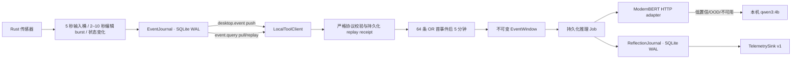

# WhaleHall 行为理解与反思系统

## Timeline v2：零扩展语义消费与 Agent 输入

v1 `DesktopReflectionService` 和 `reflections.sqlite3` 暂时保留为目标
控制与回滚兼容链路，但不再驱动主动反馈，也不进入 v2 训练。新的 Timeline
v2 使用独立 consumer、独立数据库和独立 Schema，不会把 v1 进程噪声重新
解释为训练样本：

```mermaid
flowchart LR
  Observer["内置 macOS Observer"] --> Observation["加密 ObservationJournal"]
  Observation --> Semantic["semantic-event.v2"]
  Semantic -->|"semantic.query · includeContent=true"| Collector["64 条 OR 首事件后 5 分钟"]
  Collector --> Vault["Rust vault"]
  Vault --> TimelineDb["timeline-v2.sqlite3 · 仅 contentRef/状态"]
  TimelineDb --> Facts["确定性 EvidenceFactV2"]
  Facts --> Episodes["跨窗 ActivityEpisodeV2 revision"]
  Episodes --> Qwen["本机 qwen3:4b · 有引用假设"]
  Qwen --> Summary["TimelineSummaryV2"]
  Summary --> Outbox["AgentInputV1 · HELD_LOCAL"]
```



### macOS 零扩展 Observer 与隐私边界

`native/observer` 构建为 Swift 6、macOS 14+ 的
`WhaleHall Observer.app`。它由 Rust 子进程监督，只通过 stdin/stdout
JSONL 通信；Rust 完成 ObservationJournal 事务后才 ACK。Observer 使用
NSWorkspace、AXObserver/AXUIElement、CGEventTap，以及
ScreenCaptureKit + Vision 的前台单帧 OCR，不依赖 Chrome、VSCode、飞书或
其他第三方扩展。

- 观察默认关闭，必须由用户在侧栏显式启用，并分别授予辅助功能、屏幕录制、
  输入监控和受支持浏览器自动化权限；
- 只统计按键/点击/滚动/移动量，不读取 keyCode，不保存鼠标坐标；文字只能
  来自应用最终显示的 AX/OCR 状态；
- AX 文本只接受未隐藏、具有有效几何范围且与当前焦点窗口相交的节点，并优先
  遍历 `AXVisibleChildren`；无法证明可见时不遍历完整 AX 树，改走前台窗口
  OCR 或记录 coverage gap；
- 用户排除、已识别的密码管理器/系统认证/支付/钱包、SecureField，以及隐私
  状态无法验证的浏览器会 fail closed；只写匿名 `coverage.gap`，不写真实
  app identity、PID 或内容；
- OCR 图像只在内存中存在；AX 足够时不 OCR，任务串行且只保留最新结果；
- Observer 启用 App Sandbox，但不授予 network client/server entitlement；
  Apple Events 仅 allow-list 当前支持并能验证隐私状态的 Chromium 浏览器；
- stdout 写入位于独立串行队列。未 ACK 上限为 256 帧/16 MiB；压力下合并
  input bucket、只保留最新 OCR，并把 gap 持久化进审计 coverage。

ObservationJournal 的正文使用 AES-256-GCM 字段加密，随机 96-bit nonce，
AAD 绑定记录身份、Schema、时间、内容 hash 和 key version。正式签名制品
只接受 `AfterFirstUnlockThisDeviceOnly` Data Protection Keychain。
无 Developer ID 的 dev/canary 可显式启用隔离的 login-Keychain fallback，
但只有现代写入精确返回 `-34018` 且当前 binary 为 ad-hoc、没有 Team ID 时
才生效；状态固定显示 `dev_legacy_keychain_in_use`。它不允许文件或明文密钥
回退，也不会在已签名制品中生效。
Keychain 在首次解锁前不可用，或 dev/canary 因重新 ad-hoc 签名而无法打开
既有 ACL 时，Timeline v2 与解密审计保持 fail closed，但已启动的本机
监控/权限配置运行时继续可用；不会删除旧密钥或数据库，也不会进入整进程
重启循环。

一次性 legacy 迁移使用 Rust CLI `whalehall-legacy-migrate`，固定为四步
`report → migrate → verify → cleanup`。`report` 只读扫描指定
`snapshotAtMs` 之前最近七天并给出范围、计数、跳过原因、数据集 hash 和
report hash，报告不包含 payload。只有来源和 shape 均可验证的五秒 input
bucket 与 presence boundary 能迁入 v2；旧浏览器、AX、编辑器、目标、前台
应用和 process 数据继续标记为 `legacy-noise`，不会因迁移而绕过 v2 的隐私
规则。`migrate` 必须带回完全相同的 report hash，且目的库必须为空或只含
同次迁移的幂等部分；目的库已有 goal 或正常 v2 观测时 fail closed。
`cleanup` 默认不存在，只有再次验证 report/migration hash、确认来源进程已
停止并同时传入 `--delete-legacy` 与 `SOURCE_STOPPED` 才会删除精确的旧
DB/WAL/SHM。由于安全可迁子集只有 metadata，该工具明确报告
`decryptionStatus=not_applicable_metadata_only_policy`，但仍要求 v2
Keychain key 可用；它不会伪称对被跳过的旧明文做过可解密迁移。

零扩展 AX/OCR 无法数学判定一个没有 secure role、标签或上下文提示的普通
数字文本框是否为 OTP。实现会基于控件角色、窗口/可见上下文、银行卡位数和
敏感标记保守拦截，但生产发布前仍必须用真实的认证/支付回放集证明“0 泄漏”
门槛；未通过时只能继续 shadow，不能把这一限制包装成已解决。

### Rust/TypeScript 语义契约

TypeScript 在 `src/agent/timeline-v2` 手写镜像并严格校验 Rust
`semantic-event.v2`。固定事件类型为：

```text
application.foregroundChanged
application.visibleContentChanged
application.textValueChanged
browser.visiblePageChanged
ui.focusChanged
ui.controlActivated
input.activityBucket
presence.changed
goal.changed
application.processObservedBatch
coverage.gap
```

每条事件携带 observation 血缘、单调 cursor、goal version、可靠度、
coverage、content state、taxonomy/projector version 和由 Rust allow-list
决定的 `countClass`。调用方不能把进程扫描伪装成 effective：

- 前七种用户语义变化为 `effective`；
- presence/goal 为 `boundary`；
- process batch 与匿名 coverage gap 永远为 `ignored`。

消费使用命名 consumer `whalehall.timeline.v2`。push 只用于唤醒；所有数据
均从 durable journal 按 `sec2_` semantic cursor 拉取（`sc2_` 只属于 raw
observation），并明确请求 `includeContent:true`。
collector/window 经 Rust vault 成功加密后才提交 semantic cursor。目标正文
无法解密时 fail closed 并等待原 cursor 重放，不伪造目标或继续输出目标
相关性。

### 双触发与跨窗 Episode

Timeline v2 严格执行：

```text
effectiveEventCount >= 64
OR
now >= firstEffectiveEventAt + 300000ms
```

- 0 条事件不创建 timer，也不产生空 Timeline/AgentInput；
- 第 63 条不触发，第 64 条只封窗一次；
- process、heartbeat、tool、reflection 不计数；
- goal/AFK/锁屏/睡眠在非空窗口上优先封窗；
- 授权撤销优先于全部触发并丢弃尚未处理的 open window；
- 每个 semantic event 只属于一个主窗口，最多五条、30 秒的前窗内容仅作
  `contextOnly`。

处理窗口只是崩溃恢复和 AgentInput 幂等单位，不等于一项活动。
EvidenceFact 由固定中文模板渲染，保留
`observation → event → fact` 精确血缘。Episode 以应用、窗口、文档或页面
anchor、30 秒无活动和 presence/goal boundary 分段；小于 10 秒且返回原
anchor 的切换作为 supporting evidence。同一 goal 下、间隔不超过 90 秒且
anchor 兼容的相邻窗口写成同一 `episodeId` 的新 immutable revision，并
指向 `supersedesRevisionId`。迟到证据生成 correction/revision，不覆盖旧
摘要。

ModernBERT v2 就绪前使用明确标记的 deterministic cold-start classifier。
Qwen 只生成一句以“可能在”开头的假设，必须引用该 Episode 内 1–8 个
`factId`；Schema 或引用校验失败一次后使用确定性模板。事实子项永远来自
EvidenceFact renderer，Qwen 不能撰写或改写事实。无目标时 relevance 为
`null`。

### TimelineJournal、vault 和本地 Outbox

`timeline-v2.sqlite3` 的 collector snapshot、window、fact、episode、
summary 和 AgentInput 全部只保存 Rust vault `contentRef`。SQLite 明文列只
包含 ID、不可逆 hash、时间、计数、状态、revision 和 lease 元数据：

- Rust vault 负责 macOS Keychain、AES-256-GCM、nonce 和 key version；
- collector/window 内容七天到期；
- fact/episode/summary/AgentInput 默认三十天到期；
- 七天后重建不含旧 raw context 的 collector；三十天后同步清理 Timeline
  SQLite 索引行并 truncate WAL，避免只删 vault 密文却永久保留索引；
- vault 不可用时写入失败，绝不退化为明文；
- DB、WAL、SHM 权限为 `0600`，父目录为 `0700`。

每个完成窗口原子写入 `TimelineSummaryV2` 和一个确定性
`AgentInputV1`。Outbox 初始状态始终为 `HELD_LOCAL`，没有 dispatcher 和
网络上传。未来必须显式 release 后才进入
`READY → LEASED → ACKED`；lease 到期可重领，Agent 按 idempotency key
去重。

推理 Job 使用真实的持久化阶段：

```text
READY → RUNNING → RESULT_PERSISTED → COMMITTING → COMMITTED
             ↘ RETRY_WAIT → TERMINAL_FAILED
```

结果、Fact、Episode、Summary 与 `HELD_LOCAL` Outbox 在一个 IMMEDIATE
事务内完成后才进入 `RESULT_PERSISTED`；`COMMITTING` 和 `COMMITTED`
分别使用后续事务。重启看到两个中间态时只做幂等 finalize，绝不重新运行
ModernBERT/Qwen 或复制 Outbox。

`TrainingDatasetSink` 当前只有 disabled 接口和 Null implementation。
构造 Timeline service 时若传入 enabled sink 会直接拒绝；本阶段不会连接
家里云或其他远端，也不展示时间线页面。

### 五分钟审计导出

`TimelineFiveMinuteAuditExporter.exportFiveMinutes(fromMs)` 固定导出
`[fromMs, fromMs + 300000)`：

```text
manifest + permissions/coverage
+ rawObservations
+ semanticEvents
+ evidenceFacts
+ episode revisions
+ timeline summaries
+ observation → event → fact → episode → timeline lineage
```

默认导出遮蔽正文、假设和 Fact 参数；只有调用方显式请求
`includeDecryptedContent:true` 时，Rust 才可返回仍在保留期且已授权的文本。
导出协议不包含截图字节或路径。Renderer 只能请求 Bun 执行文件导出，永远
拿不到 audit bundle、Held AgentInput、明文或完整文件路径。解密导出需要
原生二次确认和目录选择；文件以 `O_EXCL`、`0600` 新建并 `fsync`，不会覆盖
已有文件。任一 raw/event/fact/episode/summary 跨越所选五分钟边界时，导出
会 fail closed 地省略该层内容，在 manifest 记录各层 omission 数并把 coverage
标为 unavailable，绝不把相邻时段的明文一并导出。默认脱敏还会在 Bun
边界再次执行 raw allow-list 和字符串脱敏，解密模式也会剥离任何截图、像素
缓冲或临时文件字段。

WebView 的生产 CSP 只允许自身资源和 Electrobun 固定使用的
`ws://localhost:*` 本机 RPC。该通道使用每个 WebView 独立的 AES-GCM
密钥；生产 CSP 不允许任何 localhost HTTP，也不允许 5173 HMR。5173 的
开发连接仅由 Vite dev transform 临时加入。Renderer 不再拥有通用
`tool.list/tool.call/tool.cancel` 或 Local Tool 事件通道，因此无法直接
查询 legacy 浏览器历史、AX 树或调用数据清理工具。

stable macOS 构建会无条件要求 Developer ID、十位 Team ID、
Hardened Runtime 与 notarization 开关；缺任一项在配置或内层 native 构建
阶段立即失败。签名顺序固定为 Rust child、Observer、外层 Electrobun app。
由于 Electrobun 在配置模块抛异常时会尝试默认配置，release gate 使用进程级
fail-closed 终止，并由子进程回归测试覆盖，禁止回退后继续生成未签名 stable。
dev/canary 仍可 ad-hoc 构建，但会被明确标记且不能作为生产制品。
运行时只接受 `dev|canary|stable` 三种 channel；每次启动固定 sibling
Observer 前都会重新检查 bundle ID 和 `codesign --verify --strict`，stable
还要求 Rust child 与 Observer 的非空 Team ID 完全一致。

## Legacy v1 回滚边界

WhaleHall 已实现可运行的本地事件与反思骨架：



- Rust `EventJournal` 负责事件落盘、确定性事件 ID、单调 cursor、进程内主动推送、pull 补播和 named-consumer commit；启动时及此后每日执行一次 30 天、受最慢 consumer cursor 保护的清理。
- 正常目标切换只经专用 `event.goal.change` 协议原子写入
  `goal.contextChanged` 并返回 durable cursor；本地协议不开放任意事件
  append，稳定 dedup key 的重放返回同一事件。
- 窗口内以 EventJournal cursor/数组顺序作为唯一总序；多传感器的
  `occurredAtMs` 允许回拨，训练导出不得按生产者时间重排不可变窗口。
- Rust 输入、进程、浏览器、Accessibility 和 VS Code 传感器先完成聚合与状态变化去重，再把确定性语义事件写入 EventJournal。TypeScript 不保留跨崩溃不安全的内存去重状态，只按 cursor 重放并统一执行反思封窗。第 64 条事件立即封窗，或第一条有效事件后 300,000ms 封窗。
- `reflections.sqlite3` 原子保存 collector snapshot、不可变窗口、READY job 和最终 `ReflectionV1`。推理与 sink 提交使用租约和幂等 `windowId` 恢复。
- ModernBERT 仅返回分类概率、相关性、256 维 embedding、OOD 分数和模型版本，不生成自由文本。
- Qwen 只在 ModernBERT 低置信、OOD 或暂不可用时做本地类别仲裁；其输出不作为校准概率，也不保存思维链。
- window builder 的不可变 `modelInput` 固定限制为估算 3,000 token 且
  32 KiB。超过时仍保留全部语义事件的 kind/时间骨架，并优先从最新
  主证据开始补充有界 payload；训练导出端使用同样的确定性规则。
- Student 训练与线上 artifact runner 再使用制品内锁定并做 SHA-256
  指纹校验的 ModernBERT fast tokenizer 精确计数，单序列编码
  `modelInput`，不重复拼接 `goalText`，也不允许通用 tokenizer 截断。
  超过制品 token 上限时仍须保留全部事件骨架，并按“最新主证据优先”
  结构化裁剪；无法无损保留骨架则 fail closed。
- Student 训练和线上推理进一步共用 artifact tokenizer 的精确预算：
  以单序列直接编码不可变 `modelInput`，不再把 `goalText` 重复拼接成句对；
  超过 8,192 token 时按
  `all-skeletons-latest-primary-first.v1` 做结构化裁剪。所有事件骨架仍必须
  保留，否则 fail closed。activity mask 由 fast tokenizer 对 `[EVENTS]`
  之后文本的 offset mapping 生成。
- runtime v2 固定上述输入合约和训练 tokenizer SHA-256；serving 仅从
  artifact 本地加载 tokenizer 并核对指纹，拒绝旧的 `longest_first`
  artifact。
- Student CUDA 训练默认自动选择 BF16（硬件不支持时为带 GradScaler 的
  FP16）并开启 encoder gradient checkpointing；CPU/MPS smoke 自动保持
  FP32。runtime/manifest 同时记录请求精度、实际精度、checkpointing 与
  micro-batch，避免仅靠命令日志推断训练条件。

仓库中没有伪造“已训练模型”。在完成真实授权数据、Teacher gate、GPU 训练、校准、三种随机种子、消融和冻结测试之前，ModernBERT endpoint 可能不可用；窗口会保留并按持久化退避策略重试。

## 事件计数与边界

计数前先完成语义合并：

- 键鼠样本进入固定 5 秒桶，一桶固定计为一条；
- 睡眠或长暂停后直接重对齐到最新完成的 epoch 桶，不补播中间空桶；
- VS Code 原始 delta 仅进入私有 Rust spool inbox；同文档编辑在静默 2 秒后成 burst，连续编辑 10 秒强制封 burst，只有完成的 burst 进入 EventJournal；
- 一次进程扫描的启动/退出合为一条；
- 相同前台应用、URL 和焦点的连续重复观测去重；
- goal、AFK、锁屏和睡眠为封窗边界，不计入 64；
- `reflection.*`、`tool.*` 和 heartbeat 永不进入反思计数。

Collector 没有事件时不创建五分钟 timer，不产生空反思。每个事件只属于一个窗口；上一窗口最多五条、30 秒、96 token 的内容只能作为 `contextOnly`，不重复计数或充当新证据。

边界优先级以 EventJournal 的持久化总序为准。封窗前服务会先拉取并物化
当时可见的 durable high-watermark；该范围内时间戳相同的事件按
`撤权 > goal/presence 边界 > count > deadline` 判定。high-watermark
之后才落盘的事件属于后续总序，即使生产者时间戳碰巧相同，也不会回写或
篡改已经封存的不可变窗口。这样“同时”有可恢复、可测试的定义，且 cursor
不会因跨传感器调度顺序被倒退提交。

新产生的 presence 事件使用检测时刻作为 EventJournal 的
`occurredAtMs/observedAtMs`，避免睡眠恢复后的历史估算时间倒退跨越其他
传感器 cursor。兼容旧数据时，早于当前窗口首事件的迟到边界只持久化
receipt；发生在窗口内但迟到的边界仍优先于 count，并以观测时刻封窗，
保证窗口结束时间不早于其中任何证据，也不把旧 cursor 移入下一窗口。

## 本机文件

默认位于 Electrobun 的应用数据目录；开发/测试可用 `WHALEHALL_DATA_DIR` 隔离：

| 文件 | 内容 |
| --- | --- |
| `events.sqlite3` | Rust 原始语义事件、cursor、consumer commit |
| `reflections.sqlite3` | collector snapshot、EventWindow、jobs、ReflectionJournal |
| `reflection-identity.v1.json` | 非秘密的稳定 installation/window identity，权限 `0600` |
| `usage.sqlite3` | 前台应用 session |
| `accessibility.sqlite3` | 明确授权后的 UI tree、语义状态与 durable outbox |
| `editor-bridge/editor.sqlite3` | VS Code claimed segment、durable open burst 与幂等 outbox；目录 `0700`、SQLite/WAL/SHM `0600` |

键鼠聚合器只在内存中累计当前五秒桶；非空桶直接写入
`events.sqlite3`，不会另建原始输入数据库。

## 隐私与授权

全局输入采集默认关闭。只有设备所有者或明确授权试用设备才可以设置：

```bash
WHALEHALL_INPUT_MONITORING_ENABLED=true bun run dev
```

macOS 仍需单独授予 Input Monitoring 权限。显式产品开关与系统权限是两个条件；任一条件缺失时传感器保持 disabled/degraded，而不是暗中采样或使应用崩溃。
运行期撤权会写入不计数的 `authorization.revoked`；若权限在 WhaleHall
停止期间被撤销，启用态重启也会立即补写一次 revoke（已持久化则不重复）。
授权状态以 EventJournal 为准跨进程持久化，因此即使 WhaleHall 在撤权和恢复
之间重启，listen-only tap 恢复后也会先写入 `authorization.granted`，再恢复
聚合事件。没有前置撤权的初始授权不会产生伪造的 grant。

输入事件只包含：

```json
{
  "keyCount": 12,
  "clickCount": 3,
  "scrollDelta": 5,
  "mouseDistance": 281.4,
  "bucketStartedAtMs": 1000,
  "bucketEndedAtMs": 6000
}
```

永不记录具体键值、密码、剪贴板、原始按键序列或鼠标绝对坐标。编辑正文、完整 URL 等 content 级信息必须另有明确授权；默认反思链路应优先使用应用、域名、角色、字符增删量等 metadata。

VS Code 编辑采集还要求显式设置
`WHALEHALL_VSCODE_BRIDGE_DIRECTORY`。未设置时 Rust 不猜测路径、不打开
editor SQLite，也不启动轮询。扩展的 `includeText` 是独立的正文授权；
metadata segment 不能携带文本。原始 delta 在同一 SQLite 事务中形成
durable bounded burst 后立即删除，永不作为 DesktopEvent 发布。

浏览器事件与正文信息是两道独立授权，默认都关闭：

```bash
WHALEHALL_BROWSER_EVENT_MONITORING_ENABLED=true
WHALEHALL_BROWSER_CONTENT_MONITORING_ENABLED=false
```

metadata 模式只发布真实的 tab open/navigation/close 状态变化，不包含
URL 或标题；这些状态变化不会因为 payload 为空而被误判成重复轮询。

Accessibility 也采用两道默认关闭的授权：

```bash
WHALEHALL_ACCESSIBILITY_MONITORING_ENABLED=true
WHALEHALL_ACCESSIBILITY_CONTENT_MONITORING_ENABLED=false
```

metadata 模式只产生焦点角色等不含 value/document text 的事件；正文开关
开启后才允许有界 value/document change。password/secure/protected 节点
无论配置如何都不会写入值或正文。snapshot 与 event outbox 在同一 SQLite
事务中提交，EventJournal 瞬态失败后可幂等补写。

活动目标最多 1,000 个 Unicode 字符。客户端启动而计划系统没有恢复出
当前目标时会显式同步 `null`。每次 native spawn 前，Bun 都先提交一个严格
校验的 startup goal intent；EventJournal 在同一个 SQLite `IMMEDIATE`
事务中读取最新持久目标状态（包括尚未被 collector commit 的 tail），若已
达到目标则 no-op，否则按最新 revision 重基并追加目标边界。该事务完成后
才允许 resident sensors 启动，collector 随后按 cursor 补播并按目标语义
校验结果。整个 Bun 进程崩溃后的重放、新 timestamp 和 goal RPC 响应丢失
都不会产生重复边界或把目标回滚；生产启动 gate 也会阻止工具 RPC 抢先
拉起未对账的传感器进程。同步采用 latest-wins 队列并持续重试到 runtime
对同一目标返回精确 ACK。退出账号会先清空本地目标并等待 `null` ACK，再
切换账号，避免旧目标继续影响相关性判断。

## 模型运行配置

本机 Qwen lock：

| 配置 | 值 |
| --- | --- |
| Ollama | `0.24.0` |
| 模型 | `qwen3:4b` |
| digest | `359d7dd4bcdab3d86b87d73ac27966f4dbb9f5efdfcc75d34a8764a09474fae7` |
| 参数/量化 | `4.0B` / `Q4_K_M` |
| context | `4096` |
| 并发 | `1` |
| keep alive | `30m` |

运行时在发送任何窗口前只读检查 `/api/version` 和 `/api/tags`；版本、digest、参数规模或量化不匹配时 fail closed，不会静默换模型。请求固定使用 `/api/chat`、structured output、`think:false` 和 `temperature:0`。

ModernBERT 默认只访问：

```text
http://127.0.0.1:8765/v1/reflections:infer
```

远端部署必须使用精确 HTTPS origin allowlist：

```bash
WHALEHALL_MODERNBERT_ENDPOINT=https://model.example/v1/reflections:infer
WHALEHALL_MODERNBERT_ALLOWED_ORIGINS=https://model.example
WHALEHALL_MODERNBERT_TOKEN='runtime-secret-from-secure-env'
```

不要把 token 写入仓库、训练 manifest 或日志。更简单的家里云验证方式是将远端 loopback 推理端口通过现有 SSH 控制路径转发到本机 `127.0.0.1:8765`，这样模型输入仍使用默认 loopback policy。

## 家里云只读核验

2026-07-29 通过主 FRP SSH 路径核验 `arch-server`：

- 基础模型位于 `/srv/models/modernbert-base`，包含 `model.safetensors`、config 和 tokenizer；
- 安装环境位于 `/opt/modernbert-base`；
- GPU 为 4,096 MiB RTX 3050 Ti Laptop；
- 当时没有 ModernBERT inference service/listener；`127.0.0.1:9000` 是 ClickHouse，不是模型服务；
- 家里云 Ollama 仍只有较弱的 Qwen 模型，因此不作为本计划 Teacher。

这台机器用于制品存储、加载 smoke 和部署验证。完整 DAPT/蒸馏/主动学习训练应在 16–24 GiB CUDA 节点执行。

## 训练

训练实现、数据配置和模型代码不属于 WhaleHall 桌面应用仓库，也不得由应用
仓库的远端或发布流水线分发。本机开发时使用独立、未纳入 Git worktree 的
`WhaleHall-Training` 工作目录；应用仓库只保留运行时输入输出协议和模型版本
校验。

训练工作区最低验证：

```bash
cd /path/to/WhaleHall-Training
PYTHONPATH=. python3 -m unittest discover -s tests -v
```

应用运行时单独验证：

```bash
bun test tests/reflection-*.test.ts tests/ollama-*.test.ts
bun run check
```

正式运行 30 万候选或约 50 万次 Teacher 标签前，必须先用 1,000 个真实窗口记录 p50/p95、tokens/s、labels/day 并通过 Teacher gate。只有一台 Mac 的数据只能称为个人模型；跨用户结论需要约 60–100 台明确授权设备和冻结的 participant-first 测试集。
